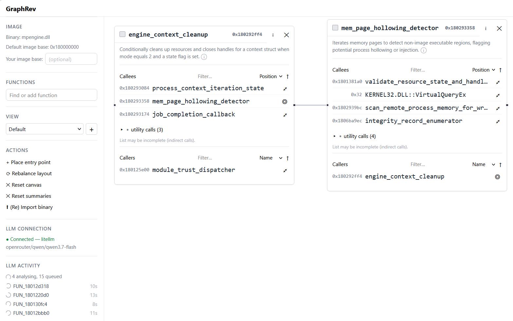
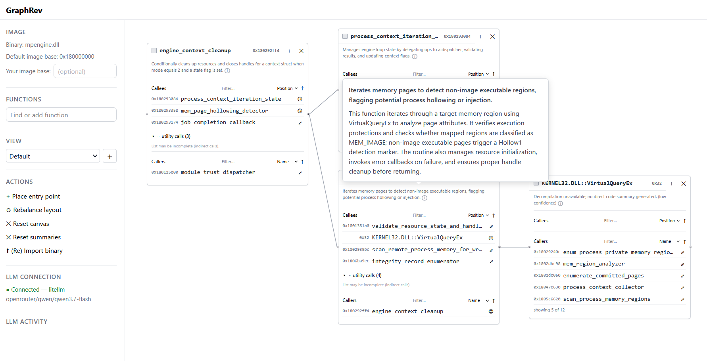

# REvAId

**I cant code but i must reverse**

> Cant read asm? dont understand C pointers? Dont know what a basic block is? Tired of having FUN_*? Or just being sick of it? Fear not, REvAId is here!

REvAId is a semantic function graph explorer for binary reverse
engineering: it renders a binary's call graph as interactive cards, lazily
summarizes functions with an LLM, and lets an analyst annotate what they
find. 

Purpose: 
* Reverse engineer binaries without reading C/ASM code, only LLM summaries in a function call graph (ai-assited reversing)
* Manually verify the results of your super duper next generation AI reversing analysis (ai-reversing verification)

This is 100% vibe coded. See `IDEA.md`, `PRD.md`, `TAD.md`.

## Screenshots

Reversing MS Defender: 




AI Summaries for each function:




## Usage

1) Let Ghidra analyze your binary
2) Export Ghidra data with the included script to JSON
3) Import JSON into REvAId
4) Explore the code base

There are two AI providers available: 
* LLM based: Simple. Queries the LLM with the disassembled function code
* Agent based: Complex. Queries OpenCode agent (using Ghidra-MCP) for function analysis


## Prerequisites

- [`uv`](https://docs.astral.sh/uv/) (Python 3.12 package/env manager)
- Node.js 22+ and npm
- [`just`](https://github.com/casey/just) (task runner)

## Quickstart

```sh
just setup    # uv sync (backend) + npm install (frontend)
just migrate  # alembic upgrade head — the ONLY way the DB schema is created
just dev      # runs the API (uvicorn, :8000) and the SPA (Vite, :5173) together
```

Then open http://127.0.0.1:5173 — you should see a small panel showing live
`/health` and `/config` data, proving the frontend, backend, and database are
wired together end to end.


## Ghidra Export 

1) Click "Window" -> "Script Manager"
2) Add a new file Java with filename `GraphRevExport.java`
3) Paste [GraphRevExport.java](https://github.com/dobin/REvAId/blob/main/tools/ghidra/GraphRevExport.java)
4) Run the script
5) If asked to skip disassembly, say NO (except if you want to use AI Agent, not AI LLM)
6) Grab a cuppa and wait till the export is finished

Then in REvAId, click "import binary", and select that JSON. 


## Everyday commands

| Command | What it does |
| --- | --- |
| `just dev` | Run API + web concurrently (F3) |
| `just api` / `just web` | Run just one side |
| `just migrate` | Apply pending Alembic migrations |
| `just revision name="add x"` | Autogenerate a new migration from `db/models.py` |
| `just db-reset` | Delete the local SQLite file and re-migrate from scratch |
| `just test` | Run backend (pytest) and frontend (vitest) test suites |
| `just lint` | ruff, mypy --strict, import-linter, eslint, tsc, magic-number guard |
| `just fmt` | Auto-format both backend and frontend |
| `just gen-types` | Regenerate `frontend/src/api/generated.ts` from the live OpenAPI schema |

## Configuration

All tunable thresholds (`TABLE_ROW_CAP`, `CALLER_SUPPRESS_THRESHOLD`,
`UTILITY_FANIN_THRESHOLD`, `FAN_OUT_ALL_HARD_CAP`, `NODE_COUNT_SOFT_WARNING`,
plus adapter selection and everything else) live in
`backend/src/graphrev/core/config.py` and are set via environment variables
(prefix `GRAPHREV_`) or a `.env` file at `backend/.env` — see
`backend/.env.example`. They are exposed
to the frontend as a single payload from `GET /api/v1/config`; no component
may hard-code a threshold (enforced by `scripts/check-magic-numbers.sh`,
which also runs in CI).

`MockLlmAdapter`'s simulated latency (1-8s per TAD §6.3) is **off by
default** (`GRAPHREV_MOCK_LLM_SIMULATE_LATENCY=false`) so `just test` and
everyday `just dev` get fast, near-instant mock summaries. Set it to `true`
(plus optionally `GRAPHREV_MOCK_LLM_MIN_LATENCY_SECONDS` /
`_MAX_LATENCY_SECONDS`) when you want to manually exercise the
pending/shimmer/queue-depth UI under realistic timing. A small
`GRAPHREV_MOCK_LLM_FAILURE_RATE` (default `0.05`) stays on even with latency
off, so the summary error+retry state is reachable in a normal demo; set it
to `0` to disable.

### Public demo mode

Set `GRAPHREV_PUBLIC_MODE=true` when exposing an instance to anonymous
visitors (see `docs/adr/0006-public-mode-anonymous-views.md`). Every browser
then gets its own private views — tracked client-side in `localStorage` —
instead of everyone landing on the binary's shared default view, so
anonymous visitors cannot clobber each other's canvas (or yours).

In public mode the shared view-listing endpoint is closed and view ids are
cryptographically random, so a visitor cannot enumerate other people's
views. The view picker lists only that browser's own views, and the shared
`last-view` pointer (B16) is not written.

Off by default: a private instance keeps the single-user behaviour where
every browser shares the binary's views. Note that public mode is "secure
enough for a demo", not authorization — the view id is the credential, so
someone who learns it (a shared link, a screenshot) can still read/modify
that view. Hardening against hostile clients needs real auth.

Caveat: enable public mode on a fresh DB (or re-ingest), since random ids
are only assigned at view-creation time — flipping it on a DB that already
has sequential view ids leaves those old ids guessable.

### Real LLM summaries (litellm)

Set `GRAPHREV_LLM_ADAPTER=litellm` to summarise with a real model instead of
the mock. The adapter is backed by [litellm](https://docs.litellm.ai/), so
one configuration covers every provider it routes to — Anthropic, OpenAI,
Ollama, vLLM, OpenRouter — which is the point: retuning the model is a
config change, not a code change.

| Variable | Meaning |
| --- | --- |
| `GRAPHREV_LLM_ADAPTER=litellm` | Select the litellm adapter |
| `GRAPHREV_LLM_MODEL` | litellm router string, e.g. `anthropic/claude-sonnet-4-5`, `openai/gpt-4o`, `ollama/llama3` |
| `GRAPHREV_LLM_API_KEY` | Provider API key (put it in `backend/.env`, not the shell) |
| `GRAPHREV_LLM_API_BASE` | Base URL for self-hosted/proxied endpoints (Ollama, vLLM, an LLM gateway); leave unset for hosted providers |
| `GRAPHREV_SUMMARY_REQUEST_TIMEOUT_SECONDS` | Per-request bound (default `120`) so a hung provider cannot wedge a worker |
| `GRAPHREV_LLM_TEMPERATURE` | Sampling temperature (default `0`). Summarising is structured extraction, not creative writing — a higher value makes models wrap their JSON in markdown fences or prose |
| `GRAPHREV_LLM_JSON_ATTEMPTS` | How many times to ask before giving up on parseable JSON (default `3`). Malformed output is flaky rather than deterministic, so a retry avoids spuriously marking a function errored |

Examples:

```sh
# Anthropic (key from https://console.anthropic.com/)
GRAPHREV_LLM_ADAPTER=litellm
GRAPHREV_LLM_MODEL=anthropic/claude-sonnet-4-5
GRAPHREV_LLM_API_KEY=sk-ant-...

# Local Ollama — no key needed
GRAPHREV_LLM_ADAPTER=litellm
GRAPHREV_LLM_MODEL=ollama/llama3
GRAPHREV_LLM_API_BASE=http://127.0.0.1:11434
```

The adapter enforces a JSON response shape (`summary_short` / `summary_long`
/ `low_confidence`), clamps `summary_short` to one table row, fences
untrusted binary content (decompiled code, strings, symbol names) behind
delimited data blocks, and maps provider errors (rate limit, auth, context
overflow, connection) onto the internal error taxonomy that drives retry and
queue-pause behaviour. Which adapter produced each summary is recorded in
`functions.summary_adapter` and exposed on the API, but not surfaced in the
UI yet.

