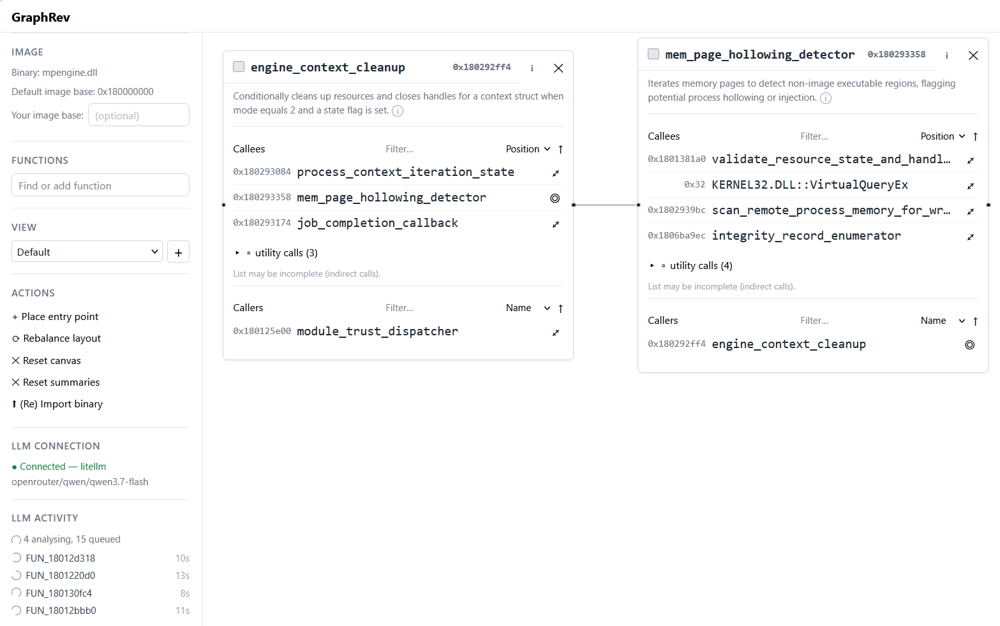
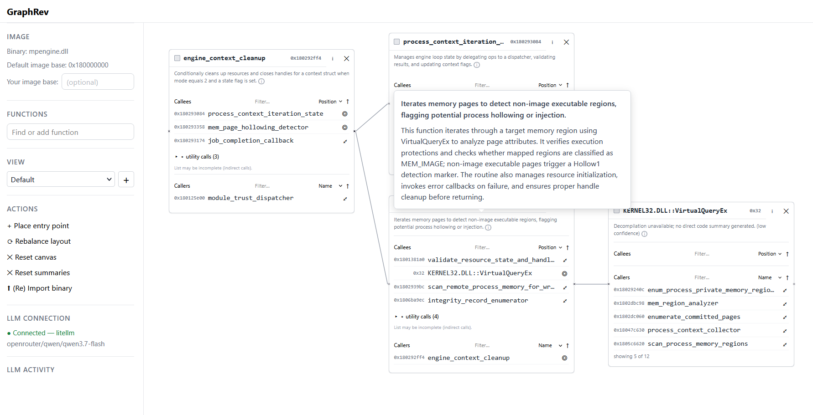

# REvAId

**I cant code but i must reverse**

> Cant read asm? dont understand C pointers? Dont know what a basic block is? Tired of having FUN_*? Have no PDBs? Or just being sick of it? Fear not, REvAId is here!

REvAId is a semantic function graph explorer for binary reverse
engineering: it renders a binary's call graph as interactive cards, lazily
summarizes functions with an LLM, and lets an analyst annotate what they
find.

Purpose: 
* Reverse engineer binaries without reading C/ASM code, only LLM summaries in a function call graph (ai-assited reversing)
* Manually verify the results of your super duper next generation AI reversing analysis (ai-reversing verification)
* Dont be dependent on PDB

Live at [REvAId.r00ted.ch](https://revaid.r00ted.ch)

This is 100% vibe coded. See the maintained developer notes in `docs/DEV.md`.

## Screenshots

All function names are AI generated. The quick summary & function name is generated based on decompiled C. 

Callees and callers can be fan-out to explore the binary (without reading any code). 

### Reversing MS Defender process injection detection




### Detailed AI Summary




## Usage

1) Let Ghidra analyze your binary
2) Export Ghidra data with the included script to JSON
3) Import JSON into REvAId
4) Explore the code base (find functions to add them to the canvas, like by their address)

There are two AI providers available: 
* LLM based: Simple. Queries the LLM with the disassembled function code
* Agent based: Complex. Queries OpenCode agent (using Ghidra-MCP) for function analysis


## Prerequisites

- [`uv`](https://docs.astral.sh/uv/) (Python 3.12 package/env manager)
- Node.js 22+ and npm
- [`just`](https://github.com/casey/just) (task runner)


## Quickstart

```sh
just setup    # uv sync (backend) + npm install (frontend)
just migrate  # migrate both the analysis and viewer databases
just dev      # analysis (:8000), viewer (:8002), and SPA (:5173)
just prod     # production-mode analysis, viewer, and SPA services
```

Open http://127.0.0.1:5173. The frontend sends browser API requests to the
viewer backend at `http://127.0.0.1:8002`; the viewer talks to the analysis
backend at `http://127.0.0.1:8000` through its internal API.

The two ASGI applications live in separate source packages: the analysis
backend is `backend/src/revaid` (`revaid.main:app`), and the viewer backend is
`backend/src/revaid_ui` (`revaid_ui.main:app`). They share lower-level domain
and persistence contracts only through `backend/src/revaid_contracts`; the
viewer obtains analysis facts through the authenticated internal HTTP API.
Each service has its own models, repositories, services, routes and startup
lifecycle. Start either independently with `just analysis` or `just viewer`.
For production, use `just prod domain=graphrev.example.com`; it builds the SPA
and starts both backends plus the static SPA preview.

The React app talks only to the **viewer backend** in split mode. The viewer backend calls the **analysis
backend** through an authenticated, fixed internal API. Upload bodies are streamed
through the viewer backend with the same configured byte limits and staged/queued only by the analysis backend; job polling
and cancellation are also forwarded to the analysis backend. Raw-binary decompilation therefore requires
the analysis backend's configured local decompiler and staging directory. The viewer backend periodically emits
a `reconcile` SSE invalidation because a cross-process event relay is not implemented yet;
this causes clients to refetch, but does not forward the analysis backend's per-summary/queue events.
Run exactly one Uvicorn worker for each analysis-backend process: import-job, summary-worker, and event
state are process-local. To run the analysis backend without
the optional UI, install the backend, apply only its schema, and start
`uv run uvicorn revaid.main:app`; it does not require npm, a browser, or a
viewer database. Start the viewer backend separately with
`uv run uvicorn revaid_ui.main:app` and configure
`GRAPHREV_ANALYSIS_INTERNAL_URL` plus the shared internal token.

### Agent access via MCP

GraphRev includes a local Streamable HTTP MCP server for agents that analyze
the imported binary database. Start it after migration and ingestion:

```sh
just mcp
```

The endpoint defaults to `http://127.0.0.1:8001/mcp`. Configure it with
`GRAPHREV_MCP_HOST` and `GRAPHREV_MCP_PORT`. Keep the default loopback binding
unless authentication and TLS are provided by a trusted reverse proxy.

The server exposes these tools:

- `list_binaries`: list binary names, versions, function counts, and edge counts.
- `find_functions`: search one binary by name, address, notes, or decompiled C.
- `get_function`: retrieve assembly, decompiled C, metadata, callers, and callees.
- `set_function_info`: write `name_llm`, `summary_short`, and/or `summary_long`.

Every function tool requires `binary_name`; `binary_version` defaults to the
empty version. Function reads and writes accept exactly one of `function_id`,
the exact decimal start `address`, or an exact stored `name`. Prefer IDs or
addresses after searching because names can be ambiguous.

### Caddy / production

The recommended deployment uses one public origin and lets Caddy route API
requests to the viewer backend, which calls the analysis backend on loopback. `just prod` binds services to
loopback by default:

```caddyfile
graphrev.example.com {
	reverse_proxy /api/* 127.0.0.1:8002
	reverse_proxy 127.0.0.1:4173
}
```

Pass the public hostname so Vite accepts Caddy's forwarded `Host` header:

```sh
just prod domain=graphrev.example.com
```


## Ghidra Export

To analyze a binary, we first needs its data: function assembly, disassembly (c code), and callers/callees (xrefs). 

This is currently achieved with a ghidra script. 

0) Open your binary in ghidra, let it analyze it
1) Click "Window" -> "Script Manager"
2) Add a new file Java with filename `GraphRevExport.java`
3) Paste [GraphRevExport.java](https://github.com/dobin/REvAId/blob/main/tools/ghidra/GraphRevExport.java)
4) Run the script
5) If asked to skip disassembly, say NO (except if you want to use AI Agent, not AI LLM)
6) Grab a cuppa and wait till the export is finished

Then in REvAId, click "import binary", and select that JSON file. 


## Everyday commands

| Command | What it does |
| --- | --- |
| `just dev` | Run analysis backend + viewer backend + frontend separately |
| `just dev-split` | Alias for `just dev` |
| `just viewer-stats` | Print viewer database row counts only |
| `just analysis` / `just viewer` / `just web` | Run one split service |
| `just migrate` | Apply both database histories |
| `just migrate-analysis` / `just migrate-viewer` | Apply one service's database history |
| `just db-reset-analysis` / `just db-reset-viewer` | Recreate one database without touching the other |
| `just revision name="add x"` | Autogenerate a new migration from `db/models.py` |
| `just db-reset` | Delete the local SQLite file and re-migrate from scratch |
| `just test` | Run backend (pytest) and frontend (vitest) test suites |
| `just lint` | ruff, mypy --strict, import-linter, eslint, tsc, magic-number guard |
| `just fmt` | Auto-format both backend and frontend |
| `just gen-types` | Regenerate `frontend/src/api/generated.ts` from the live OpenAPI schema |


## Config


### LLM summaries

Set `GRAPHREV_LLM_ADAPTER=litellm` to enable the LLM analysis. 


| Variable | Meaning |
| --- | --- |
| `GRAPHREV_LLM_ADAPTER=litellm` | Select the litellm adapter |
| `GRAPHREV_LLM_MODEL` | litellm router string, e.g. `anthropic/claude-sonnet-4-5`, `openai/gpt-4o`, `ollama/llama3` |
| `GRAPHREV_LLM_API_KEY` | Provider API key (put it in `backend/.env`, not the shell) |
| `GRAPHREV_LLM_API_BASE` | Base URL for self-hosted/proxied endpoints (Ollama, vLLM, an LLM gateway); leave unset for hosted providers |

### Backend-Specific Environment Settings

`GRAPHREV_DB_PATH` selects the analysis database (default `./graphrev.db`).
`GRAPHREV_VIEWER_DB_PATH` selects the viewer database (default
`./graphrev-viewer.db`). A standalone install may use `just migrate-analysis`
without creating or opening the viewer database. `GRAPHREV_ANALYSIS_INTERNAL_URL` and
`GRAPHREV_ANALYSIS_INTERNAL_TOKEN` configure the viewer backend's fixed connection to the analysis backend;
set the same high-entropy token on the analysis and viewer backend processes.

Examples:

```sh
# Anthropic (key from https://console.anthropic.com/)
GRAPHREV_LLM_ADAPTER=litellm
GRAPHREV_LLM_MODEL=anthropic/claude-sonnet-4-5
GRAPHREV_LLM_API_KEY=sk-ant-...

# Local Ollama — no key needed
GRAPHREV_LLM_ADAPTER=litellm
GRAPHREV_LLM_MODEL=ollama/llama3
GRAPHREV_LLM_API_BASE=http://127.0.0.1:11434
```


### Public Mode

Set `GRAPHREV_PUBLIC_MODE=true` when exposing an instance to anonymous
visitors