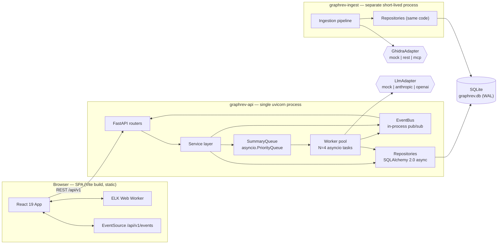
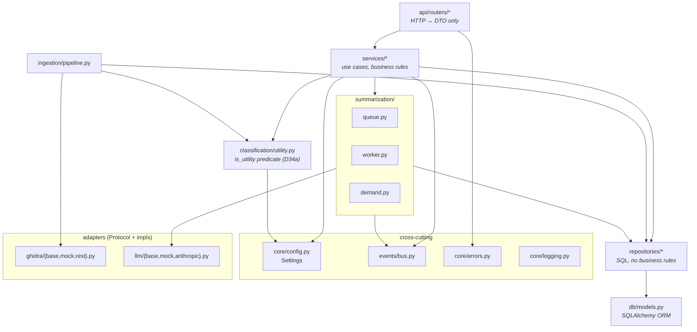
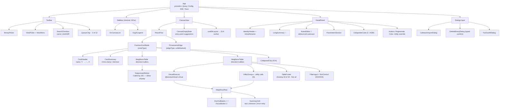
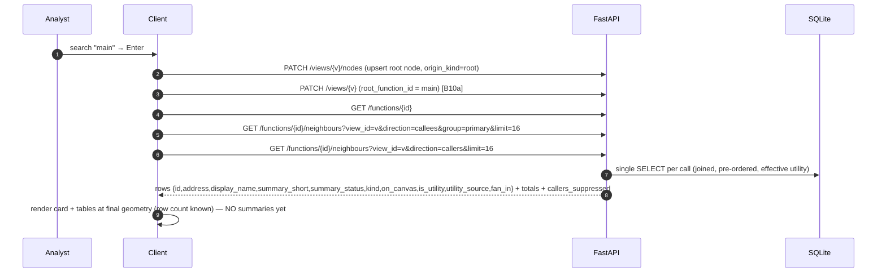
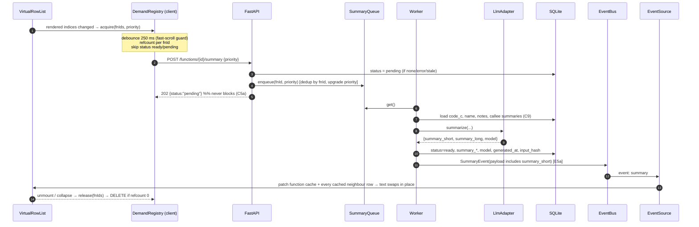
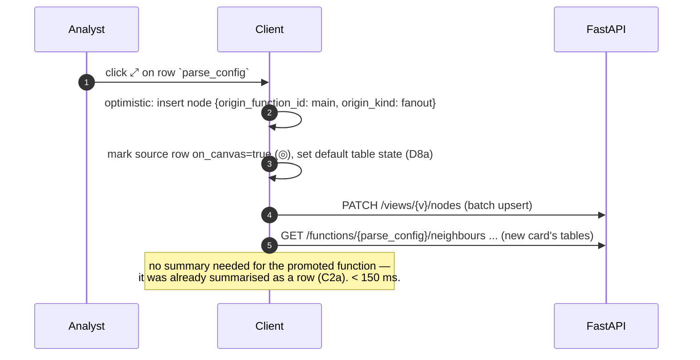
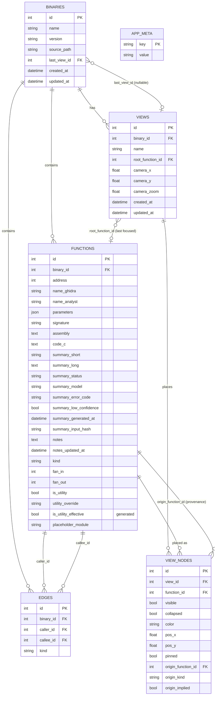

# GraphRev — Technical Architecture Document

| Field | Value |
| --- | --- |
| Product | GraphRev — semantic function graph for binary reverse engineering |
| Source of truth | `PRD.md` v0.7 (2026-08-21). Requirement IDs (`A1`, `D34`, `E2b`, `Q21`, `AS36`…) refer to that document. |
| Document owner | Principal Software Architect |
| Version | 1.0 — M0 build blueprint |
| Date | 2026-08-21 |
| Status | Approved for implementation. Ghidra and LLM adapters ship as **mocks** in M0. |
| Target editor | VS Code (workspace config included, §5.6) |

---

## 0. Architectural Summary & Guiding Principles

### 0.1 What the architecture must make easy

The PRD's product model imposes five hard technical constraints. Every choice below is justified against them.

| # | PRD constraint | Architectural consequence |
| --- | --- | --- |
| T1 | **Ground truth paints instantly; summaries arrive late and must not reflow** (§4.4) | Two independent data planes: a *synchronous* plane (names, addresses, counts, table structure — from SQLite, < 300 ms) and an *asynchronous* plane (summaries — SSE push into a normalized client cache keyed by `function_id`). Card geometry is a function of **row count**, never of summary presence. |
| T2 | **One card placement can demand ~33 summaries** (`C2a`) | Demand must be client-driven, per-function, de-duplicated, refcounted, prioritised, and cancellable. This is a first-class subsystem (`summarization/`), not a helper function. |
| T3 | **Generation outlives the request and the tab** (`C5a`, `C5b`) | The queue is server-owned in-process state with SQLite as the durable status of record. HTTP requests never block on the LLM. Startup reconciles orphaned `pending` rows. |
| T4 | **Canvas topology = analyst provenance, not the edge table** (`D8b`, `Q21`) | Canvas edges are derived **exclusively** from `view_nodes.origin_*`. The `edges` table is never queried to draw the canvas — only to build neighbour tables. This removes a whole class of graph-diffing logic. |
| T5 | **Thresholds are config, re-tunable without redeploy or re-ingestion** (`F1a`, `F1b`) | One config object, one `GET /config` endpoint, zero numeric literals in components. `is_utility` is recomputed by a startup `UPDATE`, never by re-ingestion. |

### 0.2 Guiding principles

1. **Adapters at the edges, pure domain in the middle.** Ghidra and the LLM are `Protocol`s (§6.2, §6.3). Nothing in `services/` imports a concrete adapter. This is what makes M0's mocks and M1's real integrations the same code path (`AS14`).
2. **Thin routers, fat services, dumb repositories.** Routers do HTTP↔DTO translation only. Business rules (utility ordering, suppression, provenance, demand) live in `services/`. Repositories issue SQL and return ORM rows.
3. **One source of truth per fact.** `summary_status` in SQLite is authoritative over any client or queue memory (`E5`, reconnect reconciliation). The client never infers status it did not receive.
4. **State ownership is declared, not emergent.** Every piece of state is classified server-durable / client-session / ephemeral (§3.1). `B4a` exists precisely because this was ambiguous; the code must not re-introduce the ambiguity.
5. **No premature distribution.** Single process, single SQLite file, in-process queue and event bus. The seams that would allow Redis/Postgres later (repository interfaces, an `EventBus` protocol) are present; the implementations are not.
6. **Every module is testable without the UI and without a network.** Deterministic mocks (`A2`, `C1`) make the entire M0 exit criteria reproducible in CI.

---

## 1. Technology Stack Selection

### 1.1 Stack at a glance

| Layer | Choice | Version floor |
| --- | --- | --- |
| Frontend framework | React + TypeScript (strict) | React 19, TS 5.6 |
| Build tool | Vite | 6 |
| Graph canvas | React Flow (`@xyflow/react`) | 12 |
| Auto-layout | `elkjs` in a dedicated Web Worker | 0.9 |
| Row virtualisation | `@tanstack/react-virtual` | 3 |
| Server-state cache | TanStack Query | 5 |
| Client/UI state | Zustand (sliced) + Immer | 5 |
| Styling | Tailwind CSS + Radix UI primitives | TW 4, Radix 1.x |
| Realtime transport | Native `EventSource` (SSE) | — |
| Backend framework | FastAPI (ASGI, uvicorn) | FastAPI 0.115 |
| Language / runtime | Python | 3.12 |
| Packaging / env | **uv** | 0.5 |
| ORM | SQLAlchemy 2.0 (async, typed `Mapped[]`) | 2.0 |
| DB driver | `aiosqlite` (app), `sqlite3` via sync engine (CLI) | — |
| Database | SQLite, WAL mode | 3.44 |
| Migrations | Alembic | 1.13 |
| Validation / DTOs | Pydantic v2 + `pydantic-settings` | 2.9 |
| Logging | `structlog` (JSON in prod, console in dev) | 24 |
| CLI | Typer | 0.12 |
| Backend tests | pytest, pytest-asyncio, httpx `ASGITransport` | — |
| Frontend tests | Vitest + React Testing Library; Playwright (e2e) | — |
| Lint / format | Ruff + mypy (py); ESLint + Prettier (ts) | — |
| Task runner | `just` (or npm scripts) | — |

### 1.2 Rationale — Frontend

**React 19 + TypeScript strict.** Non-negotiable given React Flow. Strict TS is load-bearing here: the PRD defines five closed enumerations (`functions.kind`, `edges.kind`, `summary_status`, `origin_kind`, `color`). These become discriminated unions and exhaustive `switch` statements, so adding `edges.kind = 'data_xref'` (`A10`) produces compile errors at every site that must handle it rather than a silent default branch.

**Vite 6.** Sub-second HMR matters for a UI-validation milestone whose entire purpose is iterating on card and table states (§4.3 of the PRD has ~50 of them). Native ESM dev server, first-class Web Worker support (`new Worker(new URL(...), {type:'module'})`) which we need for ELK.

**React Flow 12 (`@xyflow/react`), not Cytoscape / vis-network / d3 by hand.** The deciding factor is `D1` + `AS23`: nodes are **rich, variable-height, interactive DOM** — each card contains two scrollable virtualised tables, inline rename inputs, and per-row buttons. React Flow renders nodes as real React components in the DOM with CSS transforms for pan/zoom; Cytoscape and canvas/WebGL renderers would require re-implementing the card as canvas drawing plus hit-testing, which is a non-starter. v12 also gives us `useNodesInitialized` and per-node measured dimensions, which the ELK integration depends on (§2.5).

**elkjs in a Web Worker, not dagre.** `D11` requires a layered layout that tolerates back-edges (`§5.1`: cycles must not explode) and accommodates variable node heights. ELK's `layered` algorithm handles cyclic graphs via edge reversal and supports per-node `width`/`height` inputs. Dagre is lighter but unmaintained and weaker on back-edges. ELK's cost is that it is a GWT-compiled JS blob that blocks the main thread for tens of milliseconds; a worker keeps the 400 ms layout animation (`§4.3`) smooth. Node counts are small by design (`~10`, `NODE_COUNT_SOFT_WARNING = 150`), so ELK's asymptotics are irrelevant — responsiveness is not.

**TanStack Query 5 for server state; Zustand 5 for client state.** This split is deliberate and is the single most important frontend decision.

- Query owns everything the server can re-derive: binaries, views list, function detail, **neighbour pages**, entry points, config. We get request de-duplication, caching, and — critically — a **normalised patch target**: an arriving SSE summary event calls `queryClient.setQueryData` for the function detail *and* patches the matching row in every cached neighbour page (`E5a`: "one event updates all surfaces"). Doing this by hand in Zustand would mean rebuilding half of Query.
- Zustand owns canvas/session state: node positions and drag state, selection, detail-panel target, ephemeral table state (`B4a`), the demand registry, and the queue chip. Zustand's transient-update pattern (`useStore.subscribe` without re-render) is what lets a 60 fps drag mutate positions without re-rendering 10 cards containing 320 virtualised rows.
- Redux/RTK was rejected as ceremony for a single-user local tool; plain Context was rejected because the drag path demands selector-level subscriptions.

**Tailwind + Radix, not a component kit (MUI/Chakra/AntD).** §4.4's *three-tier truthfulness* requirement (ground truth in monospace, LLM output marked `✨`, analyst input marked `✎`) is a bespoke typographic system, and the function card is a bespoke widget. A kit's opinions would be fought, not used. Radix supplies only the accessible primitives we genuinely should not write ourselves: `Dialog` (callstack import, delete confirmation), `Popover` (queue chip), `DropdownMenu` (card `⋯`), `Select` (binary/view pickers), `Tooltip`. Radix also gives us the keyboard/focus semantics `§4.4` demands.

**`@tanstack/react-virtual`.** `C2a`/`§5.1` make virtualisation a **cost control**, not a rendering nicety: only rendered rows may be summarised. A headless virtualiser that reports exactly which indices are rendered is therefore a functional dependency, and its output feeds the demand registry directly (§2.6).

**SSE via native `EventSource`, no library.** `E5`/`Q26` mandate SSE only — no WebSocket, no polling. Traffic is strictly server→client (summary results, queue counts); all client→server writes are ordinary REST. `EventSource` gives automatic reconnect with backoff for free, and reconciliation is a Query invalidation on reconnect (§2.7). A WebSocket would add bidirectional framing we have no use for plus manual reconnect logic.

### 1.3 Rationale — Backend

**FastAPI on uvicorn.** Three requirements point at async Python: long-lived SSE connections (`E5`), a background worker pool sharing process memory with the API (`C5a`), and non-blocking LLM I/O at concurrency 4+ (`C5`). FastAPI additionally gives Pydantic-native request/response models and auto-generated OpenAPI (`E7`) with zero extra work — and the generated schema is what we use to type the frontend client (§6.1).

**Python 3.12.** `TaskGroup`/`asyncio.timeout` (worker supervision), `type` statement and `Self`, and a measurably faster asyncio. 3.13 is avoided only because Ghidra-adjacent tooling in M1 lags.

**uv.** Named in the PRD's own stack sketch. Beyond speed, `uv sync --frozen` from a committed lockfile gives us reproducible CI, and `uv run` removes activate-the-venv friction — which matters for `F3` (single-command dev startup) and for the `graphrev-ingest` CLI that persona P4 (Dana) runs.

**SQLAlchemy 2.0 async ORM, not raw SQL and not a micro-ORM.** The schema is genuinely relational (five tables, cascades, self-referencing FKs on both `edges` and `view_nodes.origin_function_id`), and `A3`'s idempotent-ingestion rule ("update inherent fields, never clobber `summary_*`/`name_analyst`/`notes`") is expressed cleanly as a targeted UPSERT with an explicit column allow-list. 2.0's `Mapped[]` annotations give mypy real coverage of the persistence layer. Where a query is genuinely relational-heavy — the neighbour query with effective-utility ordering — we drop to SQLAlchemy Core `select()` rather than ORM relationship traversal, to keep it a single round trip.

**aiosqlite + WAL, single writer.** SQLite is mandated by the PRD and is correct: single user, local tool, one file to back up, and the whole artifact is portable. Two operational rules follow and are enforced in `db/engine.py`:
- `PRAGMA journal_mode=WAL`, `synchronous=NORMAL`, `busy_timeout=5000`, `foreign_keys=ON`.
- SQLite permits one writer at a time. Because `B18`/`Q27` declare *no concurrency control*, we do not need optimistic locking — but we do need to avoid `SQLITE_BUSY` under the debounced write traffic from drag/camera/notes. All writes go through a process-wide `asyncio.Lock` in the unit-of-work helper (`db/uow.py`). At this write volume (a handful per second) the lock is free; it eliminates an entire class of flaky failure.

**Alembic from commit one**, even though `B12` is a *Should*. The M0→M1 transition adds real-Ghidra columns; retrofitting migrations onto an existing DB full of an analyst's notes is exactly the data-loss scenario the PRD calls "the single worst failure this product can have" (`§5.1`).

**Async everywhere, including the CLI.** The ingestion CLI wraps its work in `asyncio.run()` and reuses the same repositories as the API, so `A3`'s idempotency rule has exactly **one** implementation. Blocking Ghidra bridge calls (M1) are pushed through `asyncio.to_thread`.

### 1.4 Rejected alternatives

| Alternative | Why rejected |
| --- | --- |
| Next.js / SSR | No SEO, no server rendering benefit, no auth (`E8` = Won't). Adds a Node runtime to a Python+SQLite tool. A Vite SPA served as static files is strictly simpler. |
| Electron / Tauri desktop shell | PRD says "web application"; `AS3` assumes a desktop browser ≥ 1440 px. A shell adds packaging burden with no capability gain. |
| Postgres | Overshoots `AS1`/`AS10` (single user, ≤ 50k functions) and destroys the "one portable file" property. The repository layer keeps the door open. |
| Celery / RQ / Redis for the queue | Requires a broker process for a queue whose maximum useful depth is a few hundred items and whose durability requirement is already satisfied by `summary_status` in SQLite (`C5b`). In-process `asyncio.PriorityQueue` is the right size. |
| WebSocket / long-poll | Explicitly excluded by `Q26`. |
| GraphQL | The endpoint set is small, mostly resource-shaped, and the one complex read (neighbour tables) needs server-side ordering and suppression logic that GraphQL would push toward the client — the opposite of `E2b`. |
| Canvas/WebGL graph renderer (sigma.js, Cytoscape) | Cards are interactive DOM (see §1.2). |
| Redux Toolkit | Ceremony without payoff at this scale. |
| Storing UI state on `functions` (the `idea.md` schema) | Superseded by `B1`/`B4`: views are first-class. |

---

## 2. System Architecture

### 2.1 Deployment / process view



**Notes.** One API process; the SPA is served either by Vite in dev (proxying `/api`) or as static files from FastAPI in a single-binary-ish deployment. The CLI is a *separate process* touching the same DB file — WAL makes concurrent reader/writer safe, and ingestion is the only bulk writer.

### 2.2 Backend layering



**Dependency rule (enforced by an import-linter contract in CI):** `api → services → repositories → db`. Reverse imports are forbidden; `services` may not import `api`; nothing outside `adapters/*/` may import a concrete adapter implementation; `repositories` may not import `services` or `summarization`.

### 2.3 Frontend component hierarchy



### 2.4 The three read/write paths

#### (a) Placing a card — synchronous plane



Card geometry is fixed at this point. Nothing that arrives later may change it (T1).

#### (b) Demanding summaries — asynchronous plane



#### (c) Fan-out — free by construction



### 2.5 Layout subsystem (`D11`, `D15`)

```
useElkLayout(nodes, edges)
  ├─ input: only nodes with pinned === false   (pinned nodes are fixed obstacles)
  ├─ node width  = CARD_WIDTH (constant, AS23)
  ├─ node height = React Flow measured height (post-render, useNodesInitialized)
  ├─ elk options: algorithm=layered, direction=RIGHT,
  │               layering.strategy=NETWORK_SIMPLEX,
  │               cycleBreaking.strategy=GREEDY,        ← §5.1 cycles
  │               nodePlacement.strategy=BRANDES_KOEPF,
  │               spacing.nodeNodeBetweenLayers=80, spacing.nodeNode=48
  ├─ runs in Web Worker; request-coalesced + cancelled-on-supersede (latest wins)
  └─ output: positions → animate ≤ 400 ms (framer-motion-free: CSS transition on transform)
```

**Trigger rules.** Layout runs on: node added, node removed, or a card's measured height changing by > 8 px (table expand/collapse — `§4.3` "must handle cards changing height"). Layout **never** runs on a summary arrival (T1) and **never** moves a `pinned` node. A manual drag sets `pinned = true` permanently (`D15`).

**Growth direction is edge orientation, not a layout option.** `direction=RIGHT` lays every ELK source to the left of its target. Callee fan-out (`origin_kind = fanout`) emits `origin → node`, so the new callee lands right; caller fan-out (`origin_kind = fanin`) emits `node → origin` (`deriveCanvasEdges`), so the new caller lands left. The graph therefore grows in both directions from any card with a single, unchanged ELK configuration — the orientation lives entirely in `deriveCanvasEdges`, keeping the layout subsystem direction-agnostic.

### 2.6 Summary demand subsystem (`C2c`, `C5`, `C8`, `Q23`)

Two cooperating refcounts. This is the heart of T2 and the main defence against the PRD's "primary risk" of cost blowout.

**Client-side `DemandRegistry`** (Zustand slice, single tab per `AS36`):

```ts
type DemandKey = `${SurfaceId}:${FunctionId}`;   // SurfaceId = card id, table id, detail panel

interface DemandRegistry {
  refs: Map<FunctionId, Set<SurfaceId>>;
  acquire(fnIds: FunctionId[], surface: SurfaceId, priority: Priority): void;
  release(fnIds: FunctionId[], surface: SurfaceId): void;
}
```

- `acquire` is called from `VirtualRowList` with **exactly the rendered indices plus a 4-row lookahead**, debounced 250 ms — this is the fast-scroll guard from `§5.1`.
- A function already `ready` (or `pending`) is never re-requested; status comes from the Query cache, which SSE keeps current.
- `release` on unmount, on section collapse, on utility-group collapse, on card hide, on view switch. When the last surface releases, the client issues `DELETE /functions/{id}/summary/request`.
- Collapsed groups render nothing → never acquire → summaries are *deferred, not skipped* (`C2b`).
- Suppressed caller tables render nothing → never acquire (`D7`, `E2a`) — the single biggest cost lever.

**Server-side `SummaryQueue`**:

```python
@dataclass(order=True)
class QueueItem:
    priority: int                      # 0..3, lower wins
    seq: int                           # FIFO tiebreak within a priority
    function_id: int = field(compare=False)
    demand: int = field(compare=False, default=0)   # server refcount

class SummaryQueue:
    _pq: asyncio.PriorityQueue[QueueItem]
    _index: dict[int, QueueItem]       # function_id → item  (dedup, one per function ever)
    _inflight: set[int]
```

| Priority | Surface | PRD |
| --- | --- | --- |
| 0 | Selected card's own summary | `C5` |
| 1 | Selected card's visible table rows | `C5` |
| 2 | Other visible cards | `C5` |
| 3 | Off-screen / lookahead rows | `C5` |

- **Dedup:** one item per `function_id`, ever (`§5.1` "one in-flight generation per function"). A repeat request with a lower priority number *upgrades* the existing item (re-heapified via mark-stale-and-reinsert; the stale copy is discarded on pop).
- **Cancel is advisory and refcounted:** `DELETE` decrements `demand`; the item is dropped only at `demand == 0` **and** only if not `_inflight`. In-flight work always completes and is cached (`C8`).
- **Bounded:** `QUEUE_MAX_DEPTH` (default 500). Overflow evicts the lowest-priority, oldest item and logs a warning.
- **Rate-limit backoff is queue-wide, not per item** (`§5.1`): a `RateLimitError` sets `_paused_until` on the queue and emits one `queue` event with `paused_until`; the client shows one banner, not 12 card errors.
- **Restart recovery** (`C5b`), in the lifespan startup hook:
  ```sql
  UPDATE functions SET summary_status = 'none'
  WHERE summary_status = 'pending';
  ```
  Clients re-request on next render. No function can display "Analyzing…" with no worker behind it.

### 2.7 Event subsystem (`E5`, `E5a`, `E5b`, `Q26`)

```python
class EventBus(Protocol):
    def publish(self, event: ServerEvent) -> None: ...
    def subscribe(self) -> AsyncIterator[ServerEvent]: ...
```

In-process fan-out: each SSE connection gets a bounded `asyncio.Queue(maxsize=256)`. On overflow the connection is closed with a `reconcile` hint rather than dropping events silently — the client then reconnects and re-reads authoritative `summary_status` (`§4.3` "SSE stream drops"). A 15 s `: keepalive` comment prevents proxy idle timeouts. Events carry a monotonic `id:` so a future replay buffer is additive; M0 does not replay.

**Reconnect reconciliation (client):** on `EventSource` `open` after an error, invalidate `['function']` and `['neighbours']` query keys for currently-mounted surfaces and re-fetch `GET /queue`. Never trust client memory across a gap.

---

## 3. Data Models & Database Schema

### 3.1 State ownership matrix

The PRD's `B4a`/`Q20` exist because this was previously ambiguous. This table is normative; a field may live in exactly one column.

| State | Server-durable (SQLite) | Client session (Zustand, survives navigation, lost on reload) | Ephemeral (lost on reload / view switch / re-place) |
| --- | --- | --- | --- |
| Summaries, `summary_status`, model, timestamps | ✅ `functions` | | |
| `name_analyst`, `notes`, `utility_override` | ✅ `functions` (function-scoped, shared across views — `J6`) | | |
| `fan_in`, `is_utility`, `kind` | ✅ `functions` (ingestion-computed) | | |
| Node position, visible, collapsed, color, pinned | ✅ `view_nodes` (per view — `B4`) | in-flight drag delta | |
| Node provenance (`origin_*`) | ✅ `view_nodes` (`B4b`) | | |
| Camera x/y/zoom, `root_function_id` | ✅ `views` (`B10`, `B10a`) | in-flight pan/zoom (debounced 400 ms) | |
| Last-used view per binary | ✅ `binaries.last_view_id` (`B16`) | | |
| Selection / detail-panel target | | ✅ | |
| Demand registry refcounts | | ✅ | |
| Queue chip contents | server-owned, pushed | mirror | |
| **Table section collapse** (callers/callees) | | | ✅ `B4a` |
| **Utility-group expanded** | | | ✅ `B4a` |
| **"Show anyway"** on a suppressed caller table | | | ✅ `B4a` |
| **Per-table filter text, sort key/order** | | | ✅ `B4a` |

Ephemeral state lives in a `Map<CardId, TableUiState>` in the canvas Zustand slice, **never persisted**, and is reset by: page load, view switch, and card re-place (`D8a` — a newly fanned-out card gets defaults, not inheritance).

### 3.2 Entity–relationship diagram



### 3.3 DDL (authoritative; Alembic revision `0001_initial`)

```sql
PRAGMA foreign_keys = ON;

CREATE TABLE binaries (
    id            INTEGER PRIMARY KEY,
    name          TEXT    NOT NULL,
    version       TEXT    NOT NULL DEFAULT '',          -- free text (AS11)
    source_path   TEXT,
    last_view_id  INTEGER REFERENCES views(id) ON DELETE SET NULL,  -- B16
    created_at    TEXT    NOT NULL,                     -- ISO-8601 UTC
    updated_at    TEXT    NOT NULL
);
CREATE UNIQUE INDEX ux_binaries_name_version ON binaries(name, version);

CREATE TABLE functions (
    id                     INTEGER PRIMARY KEY,
    binary_id              INTEGER NOT NULL REFERENCES binaries(id) ON DELETE CASCADE,

    -- ground truth (ingestion-owned; overwritten on re-ingest)
    address                INTEGER NOT NULL,            -- AS7: int, hex is display-only
    name_ghidra            TEXT    NOT NULL,
    parameters             TEXT    NOT NULL DEFAULT '[]', -- JSON [{ordinal,name,type}]
    signature              TEXT,
    assembly               TEXT,                        -- NULL for placeholder/import (B17)
    code_c                 TEXT,
    kind                   TEXT    NOT NULL DEFAULT 'normal'
                              CHECK (kind IN ('normal','import','thunk','external','placeholder')),
    placeholder_module     TEXT,                        -- D35a: "which module this falls outside of"
    fan_in                 INTEGER NOT NULL DEFAULT 0,  -- A7a
    fan_out                INTEGER NOT NULL DEFAULT 0,
    is_utility             INTEGER NOT NULL DEFAULT 0,  -- derived from fan_in at ingest/startup (F1b)

    -- LLM-owned (NEVER touched by ingestion — A3)
    summary_short          TEXT,
    summary_long           TEXT,
    summary_status         TEXT    NOT NULL DEFAULT 'none'
                              CHECK (summary_status IN ('none','pending','ready','error','stale')),
    summary_model          TEXT,
    summary_error_code     TEXT,
    summary_low_confidence INTEGER NOT NULL DEFAULT 0,  -- name-only summaries (§4.3)
    summary_generated_at   TEXT,
    summary_input_hash     TEXT,                        -- C10 stale detection

    -- analyst-owned (NEVER touched by ingestion — A3)
    name_analyst           TEXT,                        -- ≤128 chars; '' → reset to Ghidra name
    notes                  TEXT    NOT NULL DEFAULT '',
    notes_updated_at       TEXT,
    utility_override       TEXT    CHECK (utility_override IN ('always','never')),  -- D36

    created_at             TEXT    NOT NULL,
    updated_at             TEXT    NOT NULL,

    -- E2b: effective classification, computed in SQL so rows arrive pre-ordered
    is_utility_effective   INTEGER GENERATED ALWAYS AS (
        CASE utility_override
            WHEN 'always' THEN 1
            WHEN 'never'  THEN 0
            ELSE is_utility
        END
    ) VIRTUAL
);
CREATE UNIQUE INDEX ux_functions_binary_address ON functions(binary_id, address);   -- B2
CREATE INDEX ix_functions_binary_name          ON functions(binary_id, name_ghidra);
CREATE INDEX ix_functions_binary_analystname   ON functions(binary_id, name_analyst);
CREATE INDEX ix_functions_status               ON functions(summary_status);        -- C5b sweep
CREATE INDEX ix_functions_fanin                ON functions(binary_id, fan_in DESC);-- E1b entry points
CREATE INDEX ix_functions_utility_eff          ON functions(binary_id, is_utility_effective);

CREATE TABLE edges (
    id         INTEGER PRIMARY KEY,
    binary_id  INTEGER NOT NULL REFERENCES binaries(id) ON DELETE CASCADE,
    caller_id  INTEGER NOT NULL REFERENCES functions(id) ON DELETE CASCADE,
    callee_id  INTEGER NOT NULL REFERENCES functions(id) ON DELETE CASCADE,
    kind       TEXT    NOT NULL DEFAULT 'call' CHECK (kind IN ('call','data_xref','string_ref'))
);
CREATE UNIQUE INDEX ux_edges_pair ON edges(caller_id, callee_id);  -- B3; self-edges allowed
CREATE INDEX ix_edges_caller ON edges(caller_id);
CREATE INDEX ix_edges_callee ON edges(callee_id);

CREATE TABLE views (
    id                INTEGER PRIMARY KEY,
    binary_id         INTEGER NOT NULL REFERENCES binaries(id) ON DELETE CASCADE,
    name              TEXT    NOT NULL,
    root_function_id  INTEGER REFERENCES functions(id) ON DELETE SET NULL,  -- B10a: last focused
    camera_x          REAL    NOT NULL DEFAULT 0,
    camera_y          REAL    NOT NULL DEFAULT 0,
    camera_zoom       REAL    NOT NULL DEFAULT 1,
    created_at        TEXT    NOT NULL,
    updated_at        TEXT    NOT NULL
);
CREATE INDEX ix_views_binary ON views(binary_id);

CREATE TABLE view_nodes (
    id                  INTEGER PRIMARY KEY,
    view_id             INTEGER NOT NULL REFERENCES views(id) ON DELETE CASCADE,
    function_id         INTEGER NOT NULL REFERENCES functions(id) ON DELETE CASCADE,
    visible             INTEGER NOT NULL DEFAULT 1,
    collapsed           INTEGER NOT NULL DEFAULT 0,
    color               TEXT,                            -- D16: palette token, not hex
    pos_x               REAL    NOT NULL DEFAULT 0,
    pos_y               REAL    NOT NULL DEFAULT 0,
    pinned              INTEGER NOT NULL DEFAULT 0,      -- D15
    -- B4b / D8b: sole source of canvas edges
    origin_function_id  INTEGER REFERENCES functions(id) ON DELETE SET NULL,
    origin_kind         TEXT    NOT NULL DEFAULT 'root'
                            -- fanin = caller fan-out; edge is oriented
                            -- node->origin so it lays out LEFT (see §2.5).
                            -- Widened by migration 0004.
                            CHECK (origin_kind IN ('root','fanout','callstack','fanin')),
    origin_implied      INTEGER NOT NULL DEFAULT 0,      -- dashed edge
    created_at          TEXT    NOT NULL,
    updated_at          TEXT    NOT NULL
);
CREATE UNIQUE INDEX ux_view_nodes ON view_nodes(view_id, function_id);
CREATE INDEX ix_view_nodes_view    ON view_nodes(view_id, visible);
CREATE INDEX ix_view_nodes_origin  ON view_nodes(origin_function_id);

CREATE TABLE app_meta (
    key   TEXT PRIMARY KEY,
    value TEXT NOT NULL
);
-- seeded: schema_version, utility_fanin_threshold (last applied → F1b recompute detection)
```

**Design notes.**

- `is_utility_effective` is a **VIRTUAL** generated column (not STORED) so future Alembic `ADD COLUMN` migrations remain possible in SQLite; SQLite indexes virtual generated columns, so `ORDER BY is_utility_effective, name` stays index-assisted. This is what lets `E2b` return rows already grouped without any client logic.
- `is_utility` is stored, not computed per query, so the utility index is usable. `F1b` is satisfied by a **startup recompute** rather than re-ingestion:
  ```sql
  -- runs only when settings.utility_fanin_threshold != app_meta.utility_fanin_threshold
  UPDATE functions SET is_utility = (fan_in > :threshold);
  ```
- Timestamps are ISO-8601 UTC strings (`§4.2` convention), stored as `TEXT` — human-readable in a SQLite browser, which matters for a locally-inspected artifact.
- **Ingestion column ownership is explicit in code.** `INGESTION_OWNED_COLUMNS` is a frozenset in `repositories/functions.py`; the UPSERT's `set_` clause is generated from it. `A3` then becomes a unit test asserting that `summary_*`, `name_analyst`, `notes`, `notes_updated_at`, `utility_override` are absent from that set — the strongest available guard against the PRD's worst data-loss scenario.
- **Search (`B11`, `E1a`, `AS10`):** M0 uses `LIKE '%q%' COLLATE NOCASE` over `name_ghidra`/`name_analyst`/`notes` with mandatory `LIMIT`/`OFFSET`. At 50k rows this is a ~5 ms scan. The documented M1 upgrade is an FTS5 external-content table with the `trigram` tokenizer (true infix matching) plus insert/update triggers — additive, no API change.

### 3.4 Shared TypeScript types (`frontend/src/api/types.ts`)

Generated from OpenAPI via `openapi-typescript`, then re-exported through hand-written aliases so component code never imports generated paths.

```ts
export type FunctionId = number;
export type BinaryId = number;
export type ViewId = number;

export type FunctionKind = 'normal' | 'import' | 'thunk' | 'external' | 'placeholder';
export type EdgeKind = 'call' | 'data_xref' | 'string_ref';
export type SummaryStatus = 'none' | 'pending' | 'ready' | 'error' | 'stale';
export type OriginKind = 'root' | 'fanout' | 'callstack' | 'fanin';
export type UtilitySource = 'computed' | 'analyst';
export type UtilityOverride = 'always' | 'never' | null;
export type NodeColor =
  | 'slate' | 'red' | 'amber' | 'green' | 'blue' | 'violet' | 'pink'; // D16 fixed palette
export type Priority = 0 | 1 | 2 | 3;

export interface BinarySummaryDto {
  id: BinaryId; name: string; version: string;
  functionCount: number; edgeCount: number;
  lastViewId: ViewId | null; createdAt: string;
}

export interface FunctionParam { ordinal: number; name: string; type: string; }

/** Full function record — detail panel + card. */
export interface FunctionDto {
  id: FunctionId; binaryId: BinaryId;
  address: number;               // render as hex in UI only (AS7)
  displayName: string;           // name_analyst ?? name_ghidra  (B6)
  nameGhidra: string;
  nameAnalyst: string | null;
  isRenamed: boolean;
  parameters: FunctionParam[];
  signature: string | null;
  kind: FunctionKind;
  placeholderModule: string | null;
  fanIn: number; fanOut: number;
  isUtility: boolean;            // EFFECTIVE (override applied) — E2b/Q25
  utilitySource: UtilitySource;
  utilityOverride: UtilityOverride;
  summary: {
    status: SummaryStatus;
    short: string | null;
    long: string | null;
    model: string | null;
    errorCode: string | null;
    lowConfidence: boolean;
    generatedAt: string | null;
    isStale: boolean;
  };
  notes: string; hasNotes: boolean; notesUpdatedAt: string | null;
  calleeCount: number; callerCount: number;
  hasIndirectCalls: boolean;     // §5.1 table footer hint
}

/** One row in a card's caller/callee table. Deliberately narrow — no code, no long summary. */
export interface NeighbourRowDto {
  id: FunctionId; address: number;
  displayName: string; isRenamed: boolean;
  summaryShort: string | null;
  summaryStatus: SummaryStatus;
  summaryLowConfidence: boolean;
  kind: FunctionKind;
  onCanvas: boolean;             // view-scoped → E2 requires view_id
  isUtility: boolean;            // effective
  utilitySource: UtilitySource;
  fanIn: number;
  isSelf: boolean;               // ↻ recursion, fan-out disabled
  hasNotes: boolean;
}

export interface NeighbourPageDto {
  functionId: FunctionId;
  direction: 'callees' | 'callers';
  group: 'primary' | 'utility';
  rows: NeighbourRowDto[];       // pre-ordered, utility last (E2b)
  total: number;                 // total in this direction+group
  totalPrimary: number;
  totalUtility: number;          // drives "▸ ▫ utility calls (N)"
  limit: number; offset: number;
  callersSuppressed: boolean;    // E2a — true ⇒ client renders one line, requests no summaries
  mayBeIncomplete: boolean;      // §5.1 indirect-call footer
}

export interface ViewNodeDto {
  functionId: FunctionId;
  visible: boolean; collapsed: boolean;
  color: NodeColor | null;
  posX: number; posY: number; pinned: boolean;
  originFunctionId: FunctionId | null;
  originKind: OriginKind; originImplied: boolean;
}

export interface ViewDto {
  id: ViewId; binaryId: BinaryId; name: string;
  rootFunctionId: FunctionId | null;
  camera: { x: number; y: number; zoom: number };
  nodes: ViewNodeDto[];
  createdAt: string; updatedAt: string;
}

/** Derived client-side from ViewNodeDto only — never from the edges table (D8b).
 *  `kind` also sets orientation: `fanin` points source=node -> target=origin
 *  (grows left), every other kind points origin -> node (grows right). */
export interface CanvasEdge {
  id: string; source: FunctionId; target: FunctionId;
  implied: boolean; kind: OriginKind;
}

export interface AppConfigDto {          // F1a — single source of every threshold
  tableRowCap: number;                   // 16
  callerSuppressThreshold: number;       // 32
  utilityFanInThreshold: number;         // 50
  fanOutAllHardCap: number;              // 50
  nodeCountSoftWarning: number;          // 150
  cardWidthPx: number;                   // 380
  summaryConcurrency: number;            // 4
  nodeColorPalette: NodeColor[];
  adapters: { ghidra: string; llm: string; llmModel: string };
}
```

---

## 4. API Contracts

Base path `/api/v1`. JSON, `camelCase` on the wire (`alias_generator=to_camel`, `populate_by_name=True`), snake_case in Python. All timestamps ISO-8601 UTC. No auth (`E8` = Won't).

### 4.1 Error envelope (`E4`)

```jsonc
// HTTP 4xx/5xx
{ "error": {
    "code": "FUNCTION_NOT_FOUND",       // machine-readable, stable
    "message": "No function 8123 in binary 2.",
    "details": { "functionId": 8123 }   // optional, structured
} }
```

`ErrorCode` is a Python `StrEnum` mirrored in TS. M0 set: `VALIDATION_ERROR`, `BINARY_NOT_FOUND`, `FUNCTION_NOT_FOUND`, `VIEW_NOT_FOUND`, `ADDRESS_UNRESOLVED`, `CONFIRMATION_MISMATCH`, `SUMMARY_ALREADY_PENDING`, `SUMMARY_PROVIDER_ERROR`, `SUMMARY_RATE_LIMITED`, `QUEUE_FULL`, `LAST_VIEW_DELETE_FORBIDDEN`, `INTERNAL_ERROR`.

### 4.2 Endpoint index

| # | Method & path | Req | Purpose |
| --- | --- | --- | --- |
| 1 | `GET /config` | `E1d` | All `F1a` constants + adapter identity |
| 2 | `GET /health` | `F4` | DB + adapter status |
| 3 | `GET /binaries` | `E1` | Picker list |
| 4 | `DELETE /binaries/{id}` | `E1` | Typed-confirm destructive delete |
| 5 | `GET /binaries/{id}/entry-points` | `E1b` | ≤ 5 empty-canvas suggestions |
| 6 | `GET /binaries/{id}/functions` | `E1a` | Paginated search (name / notes) |
| 7 | `GET /binaries/{id}/functions/by-address` | `D2` | Address jump (containing function) |
| 8 | `POST /binaries/{id}/resolve-addresses` | `E6` | Callstack dialog preview |
| 9 | `GET /binaries/{id}/views` · `POST` | `E1`,`B8`,`B9` | List / create views |
| 10 | `GET /views/{id}` · `PATCH` · `DELETE` | `E1`,`E3a` | Read (with nodes) / rename+camera+root / delete |
| 11 | `POST /views/{id}/duplicate` | `B8` | Copy layout only |
| 12 | `PATCH /views/{id}/nodes` | `E3` | **Batch** node upsert/patch |
| 13 | `POST /views/{id}/callstack` | `D17` | Import resolved chain as nodes+provenance |
| 14 | `GET /functions/{id}` | `E1` | Detail record |
| 15 | `PATCH /functions/{id}` | `E1`,`E2c` | `name_analyst`, `notes`, `utility_override` |
| 16 | `GET /functions/{id}/neighbours` | `E2`,`E2a`,`E2b` | **The card's tables.** Side-effect free |
| 17 | `POST /functions/{id}/summary` | `C2`,`E5` | Demand a summary (returns immediately) |
| 18 | `DELETE /functions/{id}/summary` | `C8` | Release demand / cancel if unstarted |
| 19 | `POST /functions/{id}/summary/regenerate` | `C7` | Force regeneration, ignore cache |
| 20 | `GET /queue` | `E1c` | Queue snapshot for the chip |
| 21 | `POST /queue/cancel-pending` | `E1c` | Drop all queued-unstarted |
| 22 | `GET /events` | `E5`,`E5a`,`E5b` | **SSE** stream |

### 4.3 Key payloads

**1 · `GET /config`** → `AppConfigDto` (§3.4). Fetched once at boot; `staleTime: Infinity`. No component may hard-code a threshold.

**16 · `GET /functions/{id}/neighbours`** — the most important read in the system.

```
GET /api/v1/functions/412/neighbours
      ?viewId=3                      (REQUIRED — on_canvas is a view fact, E2)
      &direction=callees|callers
      &group=primary|utility         (default primary; utility fetched separately on expand)
      &limit=16                      (default = config.tableRowCap)
      &offset=0
      &sort=name|address|fanIn       (default name; D23)
      &order=asc|desc
      &filter=parse                  (substring over name + summaryShort; D22)
```

```jsonc
// 200 → NeighbourPageDto
{
  "functionId": 412, "direction": "callees", "group": "primary",
  "rows": [
    { "id": 501, "address": 4198432, "displayName": "open_file", "isRenamed": false,
      "summaryShort": "Opens a path with mode flags…", "summaryStatus": "ready",
      "summaryLowConfidence": false, "kind": "normal", "onCanvas": false,
      "isUtility": false, "utilitySource": "computed", "fanIn": 3,
      "isSelf": false, "hasNotes": false },
    { "id": 507, "address": 4198990, "displayName": "lookup_key", "isRenamed": false,
      "summaryShort": null, "summaryStatus": "none", "summaryLowConfidence": false,
      "kind": "normal", "onCanvas": true, "isUtility": false,
      "utilitySource": "computed", "fanIn": 2, "isSelf": false, "hasNotes": true }
  ],
  "total": 27, "totalPrimary": 27, "totalUtility": 7,
  "limit": 16, "offset": 0,
  "callersSuppressed": false,
  "mayBeIncomplete": true
}
```

Contract guarantees, all asserted by tests:
- **No side effects.** A `GET` here never enqueues (`C2c`/`Q23`). The client asks per function, per row it rendered.
- **Pre-ordered.** Rows arrive with effective-utility grouping already applied (`E2b`); the client never re-derives it and never re-applies `utility_override`.
- **`callersSuppressed`** short-circuits: when `direction=callers` and `total > callerSuppressThreshold`, `rows` is `[]` and the client renders the one-line notice without ever fetching 291 rows (`E2a`, `D7`).
- **`totalUtility`** is returned on the `primary` page so the collapsed `▸ ▫ utility calls (7)` header renders with its count before any utility row is fetched (`D34`).

Single-query implementation sketch (callee direction):

```sql
SELECT f.id, f.address, f.name_ghidra, f.name_analyst, f.kind,
       f.summary_short, f.summary_status, f.summary_low_confidence,
       f.fan_in, f.is_utility_effective, f.utility_override,
       (f.notes <> '')            AS has_notes,
       (vn.function_id IS NOT NULL AND vn.visible = 1) AS on_canvas
FROM edges e
JOIN functions f ON f.id = e.callee_id
LEFT JOIN view_nodes vn ON vn.function_id = f.id AND vn.view_id = :view_id
WHERE e.caller_id = :fn_id
  AND e.kind = 'call'
  AND f.is_utility_effective = :group_flag
  AND (:filter IS NULL OR f.name_ghidra LIKE :like
       OR f.name_analyst LIKE :like OR f.summary_short LIKE :like)
ORDER BY f.is_utility_effective ASC, <sort_expr>
LIMIT :limit OFFSET :offset;
```

**17 · `POST /functions/{id}/summary`**

```jsonc
// request
{ "priority": 1, "reason": "table_row" }   // reason ∈ card|table_row|detail|prefetch (logging only)
// 202 Accepted — ALWAYS immediate (C5a)
{ "functionId": 412, "summaryStatus": "pending", "queuePosition": 7 }
// 200 OK — already cached (C3); no work scheduled
{ "functionId": 412, "summaryStatus": "ready", "summaryShort": "Parses the on-disk…" }
```

**18 · `DELETE /functions/{id}/summary`** → `204`. Advisory: decrements server demand; drops the queue item only at zero demand **and** not in-flight (`C8`).

**19 · `POST /functions/{id}/summary/regenerate`** → `202`, priority forced to 0, bypasses the cache check, preserves `notes` (`§5.1`).

**12 · `PATCH /views/{id}/nodes`** — batched, debounced client-side (`E3`); one request per drag *gesture*, not per frame.

```jsonc
{ "upsert": [
    { "functionId": 412, "posX": 120, "posY": 40, "pinned": true },
    { "functionId": 507, "visible": true, "originFunctionId": 412,
      "originKind": "fanout", "originImplied": false }
  ],
  "remove": [ 903 ]        // hard-delete the view_nodes row (D13 uses visible:false instead)
}
// 200 → { "nodes": ViewNodeDto[] }   full post-state, so the client can reconcile
```

**10 · `PATCH /views/{id}`** — camera and root, debounced **separately** from node state (`E3a`):

```jsonc
{ "name": "crash path",
  "rootFunctionId": 507,                        // B10a: last focused
  "camera": { "x": -240.5, "y": 88.0, "zoom": 0.85 } }
```

**8 · `POST /binaries/{id}/resolve-addresses`** (`E6`) — powers the dialog's per-line preview *before* import.

```jsonc
// request
{ "addresses": ["0x401a20", "401b40+0x1f", "  0x7ffd0000  ", ""], "reverse": false }
// 200
{ "frames": [
    { "index": 0, "raw": "0x401a20", "address": 4201000,
      "resolved": true, "functionId": 412, "displayName": "parse_pe_header" },
    { "index": 1, "raw": "401b40+0x1f", "address": 4201280,
      "resolved": true, "functionId": 415, "displayName": "read_key_value" },
    { "index": 2, "raw": "  0x7ffd0000  ", "address": 2147418112,
      "resolved": false, "reason": "NO_CONTAINING_FUNCTION" }
  ],
  "links": [ { "from": 0, "to": 1, "hasEdge": true,  "implied": false },
             { "from": 1, "to": 2, "hasEdge": false, "implied": true } ],
  "resolvedCount": 2, "totalCount": 3
}
```

Normalisation rules (`§5.1`): strip whitespace and blank lines, accept `0x` or bare hex, strip a trailing `+0xNN` offset, collapse duplicate *consecutive* addresses, resolve to the **containing** function, and never create duplicate nodes for a repeated address.

**13 · `POST /views/{id}/callstack`** — the one flow that legitimately places many nodes (`D17`).

```jsonc
{ "addresses": ["0x401a20", "0x401b40", "0x402000"], "reverse": false }
// 200 → { "view": ViewDto, "unresolved": [ {index, raw, reason} ] }
```

Server behaviour: upserts one `view_nodes` row per unique resolved function with `origin_kind='callstack'`, `origin_function_id` = the previous frame, `origin_implied = !hasEdge`; sets `views.root_function_id` to the **last** frame (`B10a`); lays the chain out vertically; leaves gaps for unresolved lines rather than silently joining neighbours.

**20 · `GET /queue`** (`E1c`)

```jsonc
{ "inFlight": [ { "functionId": 412, "displayName": "parse_config", "startedAt": "…" } ],
  "queued":   [ { "functionId": 507, "displayName": "read_line", "priority": 1 } ],
  "inFlightCount": 3, "queuedCount": 9,
  "pausedUntil": null }        // set when rate-limited → one banner, not 12 (§5.1)
```

**22 · `GET /events` — SSE (`E5`)**

```
Content-Type: text/event-stream
Cache-Control: no-cache
X-Accel-Buffering: no
```

```
id: 1041
event: summary
data: {"functionId":412,"summaryStatus":"ready","summaryShort":"Parses the on-disk configuration…",
       "summaryModel":"mock-llm-v1","lowConfidence":false,"generatedAt":"2026-08-21T10:14:02Z",
       "errorCode":null}

id: 1042
event: queue
data: {"inFlightCount":2,"queuedCount":8,"pausedUntil":null}

: keepalive
```

Event types: `summary` (`E5a` — **carries the result**, so every surface patches in place with no refetch and no reflow), `queue` (`E5b`), `binary` (ingestion completed / binary deleted), `reconcile` (server asks the client to re-read authoritative state, e.g. after a subscriber-queue overflow).

Client handler — one event, all surfaces (`E5a`):

```ts
function applySummaryEvent(qc: QueryClient, e: SummaryEvent) {
  qc.setQueryData<FunctionDto>(['function', e.functionId], (f) =>
    f && { ...f, summary: { ...f.summary, status: e.summaryStatus,
                            short: e.summaryShort ?? f.summary.short,
                            model: e.summaryModel, errorCode: e.errorCode } });

  // patch the row wherever it appears, in every cached neighbour page
  qc.setQueriesData<NeighbourPageDto>({ queryKey: ['neighbours'] }, (page) =>
    page && page.rows.some(r => r.id === e.functionId)
      ? { ...page, rows: page.rows.map(r => r.id === e.functionId
            ? { ...r, summaryShort: e.summaryShort ?? r.summaryShort,
                      summaryStatus: e.summaryStatus }
            : r) }
      : page);
}
```

### 4.4 Performance budgets (mapped to PRD §1.4)

| Path | Budget | How it is met |
| --- | --- | --- |
| Neighbour page, cached | < 300 ms | One indexed SELECT, `LIMIT 16`; no summary work; `edges(caller_id)` index |
| Callstack paste → rendered | < 2 s | One resolve call + one node batch + N cached function reads |
| Fan-out click → node on canvas | < 150 ms | Optimistic local insert; no LLM call by construction (`C2a`) |
| Cache hit rate after first pass | ≥ 90 % | Cache-first (`C3`); function-scoped summaries shared across views and surfaces |
| Summaries per card placed | ≤ 20 median | `D7` suppression + `TABLE_ROW_CAP` + virtualisation + lazy utility group |

---

## 5. Project Directory Structure

```
graphrev/
├── .vscode/
│   ├── settings.json            # ruff/mypy/eslint on save, pytest discovery, TS SDK
│   ├── launch.json              # "API (uvicorn debug)", "Ingest (mock)", "Vitest", "Playwright"
│   ├── tasks.json               # dev:all, api, web, test, lint, migrate, ingest:mock
│   └── extensions.json          # ruff, python, pylance, tailwind, eslint, prettier, sqlite-viewer
├── justfile                     # F3: `just dev` starts API + web concurrently
├── README.md
├── PRD.md
├── TAD.md
├── docs/
│   ├── adr/                     # 0001-views-not-functions.md, 0002-sse-only.md, …
│   ├── adapters.md              # how to implement a real Ghidra/LLM adapter (M1 handoff)
│   └── glyphs.md                # ⤢ ◎ ◌ ↻ ▫ ≡ 📝 ✎ — single source for legend + docs
│
├── backend/
│   ├── pyproject.toml           # uv, ruff, mypy strict, pytest, import-linter contracts
│   ├── uv.lock
│   ├── alembic.ini
│   ├── migrations/versions/     # 0001_initial.py, …
│   ├── src/graphrev/
│   │   ├── __init__.py
│   │   ├── main.py              # create_app(), lifespan: recover pending, recompute utility, start workers
│   │   ├── core/
│   │   │   ├── config.py        # Settings (pydantic-settings) — ALL F1a constants
│   │   │   ├── errors.py        # ErrorCode enum, AppError, exception handlers
│   │   │   ├── logging.py       # structlog config (F2)
│   │   │   ├── clock.py         # utc_now() — injectable for tests
│   │   │   └── hashing.py       # summary_input_hash (C10)
│   │   ├── db/
│   │   │   ├── engine.py        # async engine, PRAGMAs, session factory
│   │   │   ├── models.py        # SQLAlchemy 2.0 Mapped[] models
│   │   │   ├── uow.py           # unit of work + process write lock
│   │   │   └── seed.py          # default view creation (B9)
│   │   ├── schemas/             # Pydantic DTOs — the wire contract
│   │   │   ├── common.py  binary.py  function.py  neighbour.py
│   │   │   ├── view.py  summary.py  callstack.py  events.py  config.py
│   │   ├── repositories/
│   │   │   ├── base.py
│   │   │   ├── binaries.py
│   │   │   ├── functions.py     # UPSERT + INGESTION_OWNED_COLUMNS (A3 guard)
│   │   │   ├── edges.py
│   │   │   ├── neighbours.py    # the E2 query (Core select, single round trip)
│   │   │   ├── views.py
│   │   │   └── view_nodes.py
│   │   ├── services/
│   │   │   ├── binary_service.py
│   │   │   ├── function_service.py     # rename/notes/override, display_name resolution
│   │   │   ├── neighbour_service.py    # suppression, grouping, pagination (D6/D7/D34)
│   │   │   ├── view_service.py         # CRUD, duplicate, camera, root (B8–B10a)
│   │   │   ├── canvas_service.py       # provenance → node/edge invariants (D8b)
│   │   │   ├── callstack_service.py    # normalise, resolve, chain, implied links (D17/E6)
│   │   │   ├── search_service.py       # E1a
│   │   │   ├── entrypoint_service.py   # E1b
│   │   │   └── summary_service.py      # request/cancel/regenerate façade
│   │   ├── summarization/
│   │   │   ├── queue.py         # SummaryQueue: priority, dedup, demand refcount, bound
│   │   │   ├── worker.py        # N asyncio tasks, backoff, error mapping, event publish
│   │   │   ├── context.py       # prompt context assembly (C9) — content is adapter-owned
│   │   │   └── recovery.py      # C5b startup reconciliation
│   │   ├── classification/
│   │   │   └── utility.py       # is_utility(fn) — the single swappable predicate (D34a)
│   │   ├── events/
│   │   │   ├── bus.py           # EventBus protocol + InProcessEventBus
│   │   │   └── sse.py           # ASGI event-stream generator, keepalive
│   │   ├── adapters/
│   │   │   ├── ghidra/
│   │   │   │   ├── base.py      # GhidraAdapter Protocol + DTOs
│   │   │   │   ├── mock.py      # deterministic synthetic binaries (A2, A7, A7a)
│   │   │   │   └── rest.py      # M1 stub
│   │   │   └── llm/
│   │   │       ├── base.py      # LlmAdapter Protocol, SummarizationError taxonomy
│   │   │       ├── mock.py      # 1–8 s latency, ~5 % failures (C1)
│   │   │       └── anthropic.py # M1 stub — prompt content is USER-OWNED (AS14)
│   │   ├── ingestion/
│   │   │   ├── pipeline.py      # idempotent upsert, per-function error capture (A3, A4)
│   │   │   ├── fan_in.py        # A7a: compute fan_in/fan_out, set is_utility
│   │   │   ├── placeholders.py  # B17: materialise unresolved call targets
│   │   │   └── report.py        # A4 console report
│   │   ├── api/
│   │   │   ├── deps.py          # DI: session, settings, services, queue, bus
│   │   │   └── routers/
│   │   │       ├── config.py  health.py  binaries.py  functions.py
│   │   │       ├── neighbours.py  views.py  view_nodes.py  callstack.py
│   │   │       ├── summaries.py  queue.py  events.py
│   │   └── cli/
│   │       ├── __main__.py      # `graphrev` Typer app
│   │       ├── ingest.py        # graphrev ingest --adapter mock --binary acme.exe
│   │       └── dbtools.py       # init / migrate / stats / vacuum
│   └── tests/
│       ├── conftest.py          # in-memory DB, frozen clock, fake LLM, ASGI client
│       ├── unit/                # utility predicate, callstack normaliser, queue, hashing
│       ├── repositories/        # A3 idempotency, neighbour ordering & suppression
│       ├── api/                 # every endpoint, error envelope, SSE stream
│       └── e2e/                 # ingest-mock → explore → persist → reload
│
└── frontend/
    ├── package.json  vite.config.ts  tsconfig.json  tailwind.config.ts
    ├── index.html
    ├── playwright.config.ts
    └── src/
        ├── main.tsx  App.tsx
        ├── api/
        │   ├── client.ts        # typed fetch wrapper, error envelope → AppError
        │   ├── generated.ts     # openapi-typescript output (do not edit)
        │   ├── types.ts         # curated aliases (§3.4)
        │   └── queries/         # binaries.ts views.ts functions.ts neighbours.ts queue.ts
        ├── realtime/
        │   ├── SseProvider.tsx  # EventSource lifecycle, reconnect, reconcile
        │   └── applyEvents.ts   # cache patching (E5a)
        ├── config/
        │   └── ConfigProvider.tsx  # GET /config once; useConfig() everywhere (F1a)
        ├── store/
        │   ├── index.ts
        │   ├── canvasSlice.ts   # nodes, drag, selection, pinned
        │   ├── tableUiSlice.ts  # EPHEMERAL: collapse, filter, sort, showAnyway (B4a)
        │   ├── demandSlice.ts   # DemandRegistry (C2c, C8)
        │   └── uiSlice.ts       # panels, dialogs, toasts
        ├── features/
        │   ├── toolbar/         # BinaryPicker ViewPicker SearchOmnibox QueueChip
        │   ├── sidebar/         # OnCanvasList GlyphLegend
        │   ├── canvas/
        │   │   ├── CanvasView.tsx  CanvasEmptyState.tsx
        │   │   ├── nodes/FunctionCardNode.tsx  CollapsedChip.tsx
        │   │   ├── edges/ProvenanceEdge.tsx
        │   │   ├── layout/useElkLayout.ts  elk.worker.ts
        │   │   └── selectors/deriveCanvasEdges.ts   # D8b — from provenance ONLY
        │   ├── card/            # CardHeader CardSummary InlineRename CardMenu
        │   ├── neighbours/      # NeighbourTable VirtualRowList NeighbourRow
        │   │                    # SummaryCell FanOutButton UtilityGroup
        │   │                    # SuppressedNotice TableFooter FilterInput
        │   ├── detail/          # DetailPanel NotesEditor LongSummary CollapsibleCode
        │   ├── callstack/       # CallstackImportDialog FramePreviewList ReverseToggle
        │   └── views/           # ViewMenu CreateViewDialog DeleteViewDialog
        ├── components/          # Button Dialog Popover Tooltip Shimmer Glyph EmptyState
        ├── hooks/               # useDebouncedPatch useSummaryDemand useKeyboardMap
        ├── lib/                 # hex.ts clamp.ts palette.ts glyphs.ts
        └── styles/              # tokens.css (three-tier truthfulness typography)
```

### 5.6 VS Code workspace configuration (excerpts)

`.vscode/tasks.json` — `F3`, one entry point:

```jsonc
{ "version": "2.0.0", "tasks": [
  { "label": "dev:all", "dependsOn": ["api", "web"], "dependsOrder": "parallel",
    "group": { "kind": "build", "isDefault": true }, "isBackground": true },
  { "label": "api", "type": "shell", "isBackground": true,
    "command": "uv run uvicorn graphrev.main:app --reload --port 8000",
    "options": { "cwd": "${workspaceFolder}/backend" } },
  { "label": "web", "type": "shell", "isBackground": true,
    "command": "npm run dev", "options": { "cwd": "${workspaceFolder}/frontend" } },
  { "label": "ingest:mock", "type": "shell",
    "command": "uv run graphrev ingest --adapter mock --seed 1337",
    "options": { "cwd": "${workspaceFolder}/backend" } },
  { "label": "test", "type": "shell", "command": "just test" }
]}
```

`.vscode/settings.json` highlights: `"python.defaultInterpreterPath": "backend/.venv/bin/python"`, Ruff as the Python formatter with organise-imports on save, `"mypy-type-checker.args": ["--strict"]`, `"editor.codeActionsOnSave": {"source.fixAll.eslint": "explicit"}`, `"files.exclude"` hiding `**/__pycache__` and `**/.venv`, and `"typescript.tsdk": "frontend/node_modules/typescript/lib"`.

`.vscode/launch.json` provides a `debugpy` uvicorn launch (breakpoints inside the worker pool matter for T3), a compound "API + Chrome" configuration, and an ingest-CLI launch with `--adapter mock`.

---

## 6. Dependencies, Third-Party Services & Adapter Contracts

### 6.1 Backend dependencies

| Package | Purpose | Note |
| --- | --- | --- |
| `fastapi`, `uvicorn[standard]` | ASGI app + server | `httptools`/`uvloop` help SSE |
| `sqlalchemy[asyncio]>=2.0`, `aiosqlite` | ORM + driver | typed `Mapped[]` |
| `alembic` | migrations | `B12` |
| `pydantic>=2.9`, `pydantic-settings` | DTOs + config | camelCase alias generator |
| `structlog` | structured logs | `F2` |
| `typer` | ingestion CLI | `A1` |
| `sse-starlette` *(optional)* | SSE response helper | thin; a hand-rolled generator is acceptable — one dependency, one decision, documented in an ADR |
| `httpx` | outbound HTTP (M1 Ghidra/LLM) + test client | |
| **dev** `pytest`, `pytest-asyncio`, `pytest-cov`, `ruff`, `mypy`, `import-linter`, `freezegun` | | `import-linter` enforces §2.2 |

Deliberately absent: Redis, Celery, any graph library (server does no graph algorithms — provenance is a parent pointer), any LLM SDK in M0 (`anthropic` arrives with M1, behind the adapter).

### 6.2 Frontend dependencies

| Package | Purpose |
| --- | --- |
| `react`, `react-dom` | UI |
| `@xyflow/react` | canvas, nodes, edges, pan/zoom, minimap (`D12`) |
| `elkjs` | layered auto-layout in a worker (`D11`) |
| `@tanstack/react-query` | server-state cache + SSE patch target |
| `@tanstack/react-virtual` | row virtualisation as a cost control (`C2a`) |
| `zustand`, `immer` | canvas/session/ephemeral state |
| `@radix-ui/react-{dialog,popover,dropdown-menu,select,tooltip,tabs}` | accessible primitives |
| `tailwindcss`, `clsx`, `tailwind-merge` | styling |
| `zod` | runtime validation at the client boundary (paranoia is cheap; catches contract drift in dev) |
| **dev** `typescript`, `vite`, `vitest`, `@testing-library/react`, `@playwright/test`, `openapi-typescript`, `eslint`, `prettier` | |

Deliberately absent: any charting library, any date library (ISO-8601 + `Intl`), any animation library (CSS transitions suffice for the ≤ 400 ms layout tween), any icon pack for the glyph set (the PRD's glyphs are text characters — `lib/glyphs.ts` is the single source, shared with the legend and `docs/glyphs.md`).

### 6.3 Adapter contracts

**Ghidra (`A2`, `A5`, `A8`, `B17`)** — `adapters/ghidra/base.py`:

```python
class RawParam(TypedDict):
    ordinal: int; name: str; type: str

@dataclass(frozen=True, slots=True)
class RawFunction:
    address: int
    name: str
    parameters: list[RawParam]
    signature: str | None
    assembly: str | None          # None ⇒ import/thunk/placeholder
    code_c: str | None
    kind: FunctionKind            # normal|import|thunk|external
    has_indirect_calls: bool      # §5.1 table footer hint

@dataclass(frozen=True, slots=True)
class RawEdge:
    caller_address: int
    callee_address: int
    callee_module: str | None     # set ⇒ target outside this module → placeholder (B17)

class GhidraAdapter(Protocol):
    def list_binaries(self) -> Sequence[RawBinary]: ...
    def iter_functions(self, binary: RawBinaryRef) -> Iterator[RawFunction]: ...
    def iter_edges(self, binary: RawBinaryRef) -> Iterator[RawEdge]: ...
    def get_function(self, binary: RawBinaryRef, address: int) -> RawFunction | None: ...  # A6
```

`MockGhidraAdapter` spec (this is a *functional* requirement, not test scaffolding — the entire M0 exit criteria depends on it):

- Seeded PRNG → byte-identical output for a given seed (`A2`).
- **Two** distinct binaries (`A7`, `AS12`): `acme.exe` (~180 functions) and `libparse.dll` (~60).
- Realistic topology: a shallow entry region (`main` → 12 callees), 3–4 deep parser chains, one function with 34 callees, one with 300+ callees (dispatcher, exercising callee-table scroll), 2 recursive functions, one mutual-recursion pair, a handful of orphans.
- **Fan-in distribution with `memcpy`-class hubs** (`A7a`): at least three functions with `fan_in > 50` (one at ~291 to exercise `D7` suppression exactly as wireframed) and a long tail of `fan_in ∈ [1, 5]`.
- **At least one of each `kind`** (`AS35`) plus edges into `libparse.dll` from `acme.exe` that materialise as `placeholder` rows (`B17`) — including one placeholder with high fan-in, to prove the "no special case" claim in `§5.1`.
- Plausible names mixing `FUN_004xxxxx` with symbolic names, so the UI is exercised in both worlds.

**LLM (`C1`, `AS14`)** — `adapters/llm/base.py`:

```python
@dataclass(frozen=True, slots=True)
class SummaryRequest:
    address: int
    name: str
    parameters: list[RawParam]
    code_c: str | None
    assembly: str | None
    analyst_name: str | None      # B13
    notes: str | None             # B13
    callee_summaries: list[tuple[str, str]]   # C9 — (name, summary_short)

@dataclass(frozen=True, slots=True)
class SummaryResult:
    summary_short: str            # 1–3 lines, must clamp to ONE table row (C4)
    summary_long: str             # ~5 lines
    model: str
    low_confidence: bool = False  # name-only summary (placeholder/thunk)
    input_truncated: bool = False # §5.1 — adapter reports, GraphRev records

class LlmAdapter(Protocol):
    async def summarize(self, req: SummaryRequest) -> SummaryResult: ...
```

Error taxonomy — the worker's retry/backoff policy is driven entirely by these types, so a real adapter must map provider errors onto them:

```
SummarizationError
├── TransientProviderError   → retry ×3, exponential backoff, jitter
├── RateLimitError           → pause the WHOLE queue until `retry_after` (§5.1), one banner
├── AuthError                → fail fast, surface prominently, do not retry
├── ContextTooLargeError     → fail with a specific code; adapter owns truncation
└── PermanentProviderError   → fail, cache nothing (C6)
```

**Prompt content is explicitly out of scope** (`AS14`, `§5.2`). `summarization/context.py` assembles the `SummaryRequest`; what an adapter does with it — system prompt, model, truncation strategy — is user-owned. The architectural obligation is that the contract be *sufficient*, which is why it carries analyst name, notes, and callee summaries from day one even though M0's mock ignores them.

**Third-party services.** M0: **none**. No network egress, no API keys, no accounts. M1 adds one LLM provider HTTPS endpoint (Anthropic or OpenAI — `AS9` permits cloud) and a local headless-Ghidra process or bridge. No telemetry, ever (`AS13`).

### 6.4 Cross-cutting concerns

- **Logging (`F2`).** structlog with a request-id contextvar. Mandatory event fields: `event`, `function_id`, `binary_id`, `duration_ms`, `adapter`, `model`, `outcome`. Every LLM call and every ingestion function logs one line — this is how the `§1.4` engineering metrics (cache-hit rate, failure rate, throughput) are computed, since there is no telemetry.
- **Config (`F1a`).** One `Settings` class; `.env` + env vars; `GET /config` is its only projection to the client. CI test: grep the frontend for the literals `16`, `32`, `50`, `150` in `features/` and fail on a match outside `config/`.
- **Security.** No auth by design. Binary content — names, strings, decompiled C — is **untrusted data** and is never interpolated into an instruction position; `SummaryRequest` keeps it in dedicated data fields so a real adapter can fence it (`§5.1` prompt injection). The API binds to `127.0.0.1` by default. Notes and names are stored verbatim and rendered as text, never as HTML.
- **Accessibility (`§4.4`).** Keyboard map (`/`, `Enter`, `↑`/`↓`, `→`, `N`, `F2`, `Esc`) implemented once in `useKeyboardMap`. Table rows are a `role="grid"` with roving `tabindex` — they are the primary navigation control, so they cannot be mouse-only. Every colour carries a paired glyph; contrast targets WCAG AA.
- **Testing strategy.**
  - *Unit:* `is_utility` predicate, callstack normaliser (all `§5.1` cosmetic-noise cases), `SummaryQueue` (dedup, priority upgrade, refcount cancel, bound, pause), `summary_input_hash`.
  - *Repository:* **`A3` idempotency is the highest-value test in the suite** — ingest, edit summary/name/notes/override, re-ingest with changed code and a changed Ghidra name, assert analyst fields survive and inherent fields update. Plus neighbour ordering, suppression, and effective-utility grouping.
  - *API:* every endpoint against an in-memory DB; error-envelope shape; SSE stream asserted end-to-end with a fake LLM that resolves on command.
  - *Frontend unit:* `deriveCanvasEdges` (provenance only — assert **no** edge between independently placed callers/callees, `D8b`), demand registry acquire/release, hex formatting, summary-cell state machine.
  - *E2E (Playwright):* the M0 exit criterion, scripted — ingest mock, land on `main`, assert utility rows are at the bottom and collapsed, fan out 5, open a suppressed hub, switch views, reload and assert identical camera and positions.

---

## 7. Implementation Roadmap

Fourteen increments. Each is independently testable, each ends in a demonstrable state, and each maps to explicit PRD requirements. Increments 1–11 constitute **M0**.

### Phase A — Foundations (Increments 1–3)

**I1 · Skeleton, config, DB, migrations**
Scope: repo layout, `uv` + npm projects, `Settings` with every `F1a` constant, async engine + PRAGMAs, all five tables + `app_meta` via `0001_initial`, `GET /health`, `GET /config`, structlog, Ruff/mypy/ESLint/import-linter in CI, `just dev` (`F3`), `.vscode/` config.
Requirements: `B1`–`B3`, `B12`, `E1d`, `F1`, `F1a`, `F2`, `F3`, `F4`.
Exit test: `just dev` serves API and SPA; `alembic upgrade head` on an empty file yields the exact §3.3 schema (asserted by a schema-snapshot test); `GET /config` returns the defaults.

**I2 · Mock Ghidra adapter + ingestion pipeline + CLI**
Scope: `GhidraAdapter` protocol, `MockGhidraAdapter` to the §6.3 spec, idempotent upsert with `INGESTION_OWNED_COLUMNS`, `fan_in`/`fan_out`/`is_utility` computation, placeholder materialisation, per-function error capture, `graphrev ingest` with a summary report.
Requirements: `A1`–`A4`, `A7`, `A7a`, `A8`, `B5a`, `B17`, `D34a`, `F1b`.
Exit test: `graphrev ingest --adapter mock --seed 1337` twice → identical row counts, no duplicate rows; after manually setting `summary_short`, `name_analyst`, `notes`, `utility_override`, a third run preserves all four (**the `A3` test**); ≥ 3 functions with `fan_in > 50`; ≥ 1 row of each `kind`; changing `UTILITY_FANIN_THRESHOLD` and restarting flips `is_utility` with **no** re-ingestion (`F1b`).

**I3 · Read API: binaries, functions, search, entry points**
Scope: `GET /binaries`, `DELETE /binaries/{id}` (typed confirm), `GET /functions/{id}`, `by-address` (containing-function resolution), paginated search over names + notes, entry-point suggestions, error envelope + handlers.
Requirements: `B2`, `B11`, `D2`, `E1`, `E1a`, `E1b`, `E4`.
Exit test: search `"parse"` returns ≤ limit rows with a stable total; `by-address` on a mid-function address resolves to the container; deleting a binary cascades functions/edges/views/view_nodes and rejects a mismatched confirmation with `CONFIRMATION_MISMATCH`.

### Phase B — The card and its tables (Increments 4–6)

**I4 · Neighbour endpoint — the core read**
Scope: the §4.3 single-query implementation; effective-utility pre-ordering; `group=primary|utility` paging; `callersSuppressed` short-circuit; `totalPrimary`/`totalUtility`; filter and sort; `mayBeIncomplete`; `utility_override` PATCH.
Requirements: `D4`–`D7`, `D22`, `D23`, `D34`, `D36`, `E2`, `E2a`–`E2c`.
Exit test: the 291-caller hub returns `callersSuppressed: true` with `rows: []`; a 34-callee function returns 16 primary rows with `totalUtility: 7`; setting `utility_override='never'` moves that row into the primary group on the next call with `utilitySource: 'analyst'`; **an assertion that no row's `summary_status` changed as a result of the GET** (`C2c` side-effect freedom).

**I5 · Frontend shell + first static card**
Scope: Vite app, ConfigProvider, typed API client, Query setup, toolbar pickers, minimal sidebar, React Flow canvas, `FunctionCardNode` rendering header + summary + both tables from `NeighbourPageDto`, `VirtualRowList`, `UtilityGroup` collapsed by default, `SuppressedNotice`, all empty states, glyph legend. Summaries render whatever the DB already has; no generation yet.
Requirements: `D1`, `D3`, `D4`–`D7`, `D14`, `D21a`, `D34`, `D35`, `§4.1`, `§4.2`.
Exit test: with summaries pre-seeded by a fixture, `main` renders as one card describing 13 functions; the canvas has exactly one node; the dispatcher's 300-callee table scrolls at the cap; the hub's caller table shows the one-line notice; the utility group shows `▸ ▫ utility calls (7)`.

**I6 · Views, persistence, fan-out, provenance**
Scope: views CRUD + duplicate + default-view seeding + `last_view_id`; `PATCH /views/{id}/nodes` batch; `PATCH /views/{id}` camera/root debounced separately; ELK worker layout with pinned exemption; `deriveCanvasEdges` from provenance only; `⤢`/`◎` behaviour; row-click → detail panel; hide/collapse; colour palette.
Requirements: `B4`, `B4b`, `B8`–`B10a`, `B16`, `D8`–`D15`, `D16`, `D21`, `E3`, `E3a`.
Exit test: fan out two rows → two new cards with correct edges; drag one → `pinned`, and a subsequent layout leaves it untouched; reload → identical positions, colours, visibility, **camera and zoom**; two independently placed nodes that do call each other show **no** connector while each row shows `◎` (`D8b`); hiding a parent hides the connector but not the child.

### Phase C — The asynchronous plane (Increments 7–9)

**I7 · Mock LLM, queue, worker**
Scope: `LlmAdapter` protocol + error taxonomy, `MockLlmAdapter` (1–8 s, ~5 % failures), `SummaryQueue` (priority, dedup, refcount, bound, pause), worker pool at `summary_concurrency`, `POST/DELETE/regenerate` endpoints, `GET /queue`, `POST /queue/cancel-pending`, `summary_input_hash`, startup recovery.
Requirements: `C1`, `C3`, `C5`, `C5a`, `C5b`, `C6`, `C7`, `C8`, `E1c`, `E5`.
Exit test: `POST /summary` returns in < 20 ms with `pending`; 50 concurrent requests yield exactly 4 in flight; a duplicate request creates no second item; `DELETE` cancels a queued item but never an in-flight one; killing the process mid-queue and restarting leaves **zero** rows at `pending`; a simulated rate limit pauses the queue once rather than failing 12 items.

**I8 · SSE end to end**
Scope: `EventBus`, `GET /events` with keepalive and monotonic ids, `summary`/`queue`/`binary`/`reconcile` events, `SseProvider`, `applySummaryEvent` cache patching, reconnect reconciliation, `QueueChip` + popover.
Requirements: `E5`, `E5a`, `E5b`, `§4.3` (stream drops).
Exit test: a summary completing patches the card **and** the same function's row in a different card from a single event, with **no** refetch (asserted by a network spy) and **no** layout recomputation (asserted by an ELK-call spy); killing and restoring the stream re-reads authoritative status; the chip shows `◌ 3 of 12` and drives cancel-pending.

**I9 · Demand registry — auto-summarize with brakes**
Scope: `DemandRegistry`, `useSummaryDemand`, virtualiser-driven acquire with 4-row lookahead and 250 ms debounce, release on collapse/hide/unmount/view-switch, lazy acquire on utility-group expand, zero acquire while suppressed, priority tier assignment, all card/row summary states (shimmer, queued, error+retry, stale, low-confidence).
Requirements: `C2`, `C2a`, `C2b`, `C2c`, `C4`, `C8`, `C10`, `§4.3` (all table/card states).
Exit test — **the cost-control test, and the highest-risk behaviour in the product:** opening a card with 300 callees enqueues ≤ `tableRowCap + 4`, never 300; fast-scrolling the full table enqueues far fewer than one per row; expanding the utility group enqueues exactly 7; collapsing it cancels the unstarted remainder; opening a suppressed hub enqueues **only its own** summary; and placing one typical card demands ≤ 20 summaries (median), matching the `§1.4` target.

### Phase D — Analyst affordances and completion (Increments 10–11)

**I10 · Detail panel, rename, notes**
Scope: detail panel (identity, signature, long summary, parameters, collapsible C/ASM), inline rename on card and panel with `✎` marker, hover-reveals-Ghidra-name, reset-to-Ghidra, duplicate-name warning, notes textarea with debounced autosave, flush-on-selection-change, `📝` indicators on card and sidebar, `Regenerate`, colour picker, utility override control.
Requirements: `B6`, `B7`, `D18`–`D20`, `C7`, `D36`, `§4.4` three-tier truthfulness.
Exit test: rename → display name changes everywhere including in other cards' rows; empty rename resets to the Ghidra name; typing a note then immediately clicking another card **loses nothing**; notes and names are visually distinguishable from LLM output and from ground truth.

**I11 · Callstack import + M0 hardening**
Scope: resolve-addresses endpoint with full normalisation, dialog with per-line preview and reverse toggle, chain import with implied dashed links and gaps for unresolved frames, root = last frame, `Fan out all` with hard cap, soft node-count warning, backend-unreachable banner, fit-to-view fallback for an invalid camera, full Playwright e2e of the M0 exit criteria, OpenAPI publication.
Requirements: `D17`, `D24`, `E6`, `E7`, `B10a`, `§4.3` (callstack states), `§5.1` (callstack edge cases).
Exit test — **M0 exit criteria, scripted:** paste 10 addresses (2 unresolved, one with a `+0x1f` offset, one duplicate-consecutive) → 8 nodes, correct order, one dashed link, no duplicates; then the full journey — land on `main`, read the callee table with utility noise already at the bottom, fan out to ~5 nodes, hit a suppressed hub without degradation, work in two views, reload to the identical screen. All thresholds re-tunable via config with no component change.

### Phase E — M1 / M2 (Increments 12–14)

**I12 · Real Ghidra ingestion** — `RestGhidraAdapter` / MCP behind the I2 protocol, real `fan_in`, real placeholders, incremental single-function ingest (`A6`), resumable runs, skip reporting for stripped/packed/non-x86 inputs. Requirements: `A5`, `A6`, `A8`, `A9`. Exit: a real binary is ingested and explored **with no change to the adapter protocol** — the validation of `AS14`.

**I13 · Real LLM adapter** — provider client behind the I7 protocol, error mapping onto the §6.3 taxonomy, prompt context enrichment (`C9`), stale detection surfaced (`C10`), cost/usage tracking (`C11`), truncation reporting. Requirements: `C9`–`C11`, `AS14`. Exit: genuine summaries with no contract change; **V1–V3 from PRD §7.3 answered with evidence from a real binary**, and thresholds re-tuned by config alone.

**I14 · Analyst ergonomics (M2)** — path highlighting (`D25`), in-graph filter (`D26`), row-level indicators (`D27`), caller-table utility grouping (`D37`), Markdown export of summaries + notes (`D29`), optionally a sharper utility classifier swapped in behind `is_utility` if V2/V3 warrant it. Exit: Marcus produces a report without leaving the tool.

### 7.1 Risk register

| Risk | Likelihood | Impact | Mitigation (architectural, not procedural) |
| --- | --- | --- | --- |
| **Summary cost blowout** — the PRD's own "primary risk" | Med | High | I9 is a dedicated increment whose exit test *is* the cost bound; demand is client-driven per function; suppression, virtualisation, lazy groups, and `TABLE_ROW_CAP` are four independent levers, all config |
| Variable-height cards fight ELK; layout thrash on expand/collapse | High | Med | Layout keyed on measured height with an 8 px threshold; request coalescing with latest-wins; never triggered by summary arrival (T1); pinned nodes immovable |
| Late summaries reflow the layout and destroy the reading position | Med | High | Card geometry derives from row count, known before any summary; `SummaryCell` is fixed-height with a one-line clamp; ELK-call spy in the I8 test enforces this |
| SQLite `SQLITE_BUSY` under debounced write traffic | Low | Med | WAL + `busy_timeout` + a single process-wide write lock in the unit of work |
| Adapter contract proves wrong-shaped at M1, invalidating prompt work (`AS14`) | Med | High | Contract carries analyst name, notes, and callee summaries from I7 even though the mock ignores them; I12/I13 exit criteria are explicitly *"no protocol change"* |
| Ephemeral table state creeps into persistence | Med | Low | Physically separated: `tableUiSlice` has no persist middleware and no API client import; §3.1 is normative |
| Canvas edges quietly drift toward the `edges` table | Med | Med | `deriveCanvasEdges` is a pure function over `ViewNodeDto[]` only; it has no access to edge data, and a unit test asserts the independently-placed case |
| Notes lost on fast navigation | Low | **Critical** | Flush-pending-save on selection change (I10 exit test); notes never written by ingestion (`INGESTION_OWNED_COLUMNS`, I2 exit test) |
| Mock binary too tame to exercise real states | Med | Med | Mock spec (§6.3) mandates the 291-caller hub, the 300-callee dispatcher, recursion, mutual recursion, orphans, placeholders, and one of each `kind` |

---

## 8. Traceability — PRD Musts to Architecture

| PRD Must cluster | Where it lives |
| --- | --- |
| `A1`–`A4`, `A7`, `A7a` ingestion | `ingestion/`, `adapters/ghidra/mock.py`, `cli/ingest.py` — I2 |
| `B1`–`B5a`, `B17`, `B18` schema | §3.3 DDL, `db/models.py`, `migrations/` — I1, I2 |
| `B4a` ephemeral state | `store/tableUiSlice.ts` (no persistence, by construction) — I5 |
| `B4b`, `D8b` provenance edges | `view_nodes.origin_*`, `deriveCanvasEdges.ts` — I6 |
| `B6`–`B10a`, `B16` analyst + view state | `services/{function,view}_service.py`, `features/detail/` — I6, I10 |
| `C2`–`C2c`, `C4`, `C5`–`C8` summarization | `summarization/`, `store/demandSlice.ts` — I7, I9 |
| `C5a`, `C5b` durable background work | `summarization/{worker,recovery}.py`, lifespan hook — I7 |
| `D1`–`D21a` canvas + cards + tables | `features/{canvas,card,neighbours}/` — I5, I6, I9 |
| `D34`–`D35a` utility demotion + placeholders | `classification/utility.py`, `repositories/neighbours.py`, `UtilityGroup.tsx` — I4, I5 |
| `D17` callstack | `services/callstack_service.py`, `features/callstack/` — I11 |
| `E1`–`E6` API | `api/routers/*`, `schemas/*` — I3, I4, I6, I7, I8, I11 |
| `E5`–`E5b` SSE | `events/`, `realtime/` — I8 |
| `F1`–`F3` ops | `core/config.py`, `core/logging.py`, `justfile`, `.vscode/tasks.json` — I1 |

---

## 9. Open technical items (deliberately deferred, none blocking M0)

| # | Item | Resolution point |
| --- | --- | --- |
| TQ1 | FTS5 trigram search vs. `LIKE` scan | Measure at I3 on a 50k-function synthetic binary; upgrade in M1 if > 50 ms. Additive. |
| TQ2 | `sse-starlette` vs. a hand-rolled event-stream generator | Decide in I8 by reading the dependency; record as an ADR either way. |
| TQ3 | Serving the SPA from FastAPI's `StaticFiles` in a "single command" prod mode | Nice-to-have; `F5` (containerisation) is a *Could*. |
| TQ4 | Whether `pinned` should ever be resettable ("re-layout this node") | Product question surfaced by `D15`; add a card-menu action only if the analyst asks. |
| TQ5 | Sharper utility classifier (leaf+fan-in, Ghidra `kind`, name list) | I14, gated on V2/V3 evidence. The predicate is already isolated (`D34a`). |
```

